<div align="center">


# 🚀 Workshop Spring Boot 3 & JPA

### User Management REST API — Full Engineering Documentation

A Spring Boot 3 + Spring Data JPA + H2 educational project, documented end-to-end with
requirements, UML diagrams, data modeling, DFD, architecture, personas and wireframes.


### 🌐 Choose Language / Selecione o idioma / Elija el idioma

[](./README.md)
[](./README_PT.md)
[](./README_ES.md)

</div>

---

## 📘 About the Project

> This project is a **hands-on workshop** for building a RESTful API with **Spring Boot 3** and
> **Spring Data JPA**, backed by an **in-memory H2 database**. Its current core feature is a
> **User resource** exposed over HTTP/JSON, designed as the foundation for a full CRUD module.
>
> This README documents the project the way a real software product would be specified:
> requirements, use cases, traceability, SRS, UML diagrams, data dictionary, data flow,
> architecture, personas, journeys and UI wireframes.

---

## 📑 Table of Contents

- [1. Requirements](#1-requirements)
- [2. Use Cases](#2-use-cases)
- [3. Requirements Traceability Matrix](#3-requirements-traceability-matrix)
- [4. Software Requirements Specification (SRS)](#4-software-requirements-specification-srs)
- [5. UML & Structural Diagrams](#5-uml--structural-diagrams)
- [6. Data Model & Data Dictionary](#6-data-model--data-dictionary)
- [7. Data Flow Diagram (DFD)](#7-data-flow-diagram-dfd)
- [8. Architecture Diagram & Flowchart](#8-architecture-diagram--flowchart)
- [9. Persona & User Journey Map](#9-persona--user-journey-map)
- [10. Wireframes & Mockups](#10-wireframes--mockups)
- [🚀 Installation & Execution](#-installation--execution)
- [👨‍💻 Author](#-author)

---

## 1. Requirements

<details>
<summary><strong>📕 1.1 Functional Requirements (RF)</strong></summary>

| ID | Requirement | Priority |
|:---|:------------|:--------:|
| **RF01** | The system must list all registered users (`GET /users`). | High |
| **RF02** | The system must retrieve a single user by ID (`GET /users/{id}`). | High |
| **RF03** | The system must allow creating a new user (`POST /users`). | High |
| **RF04** | The system must allow updating an existing user's data (`PUT /users/{id}`). | Medium |
| **RF05** | The system must allow deleting a user by ID (`DELETE /users/{id}`). | Medium |
| **RF06** | The system must provide a web console to inspect the H2 database (`/h2-console`). | Low |
| **RF07** | The system must persist `User` entities in the `tb_user` table via JPA. | High |

</details>

<details>
<summary><strong>📗 1.2 Non-Functional Requirements (RNF)</strong></summary>

| ID | Requirement | Category |
|:---|:------------|:---------|
| **RNF01** | API responses must be returned in JSON format. | Usability |
| **RNF02** | The application must start with an embedded Tomcat server on port `8080`. | Portability |
| **RNF03** | The database must run in-memory (H2), requiring no external setup. | Deployability |
| **RNF04** | Code must follow a layered architecture (Entity / Repository / Resource). | Maintainability |
| **RNF05** | The system must run on Java 17+ and Spring Boot 3.x. | Compatibility |
| **RNF06** | Average response time for simple queries must be under 200ms in dev environment. | Performance |
| **RNF07** | Passwords must not be exposed in logs (future: hashing with BCrypt). | Security |

</details>

<details>
<summary><strong>📙 1.3 Business Rules (RN)</strong></summary>

| ID | Rule |
|:---|:-----|
| **RN01** | Each user must have a unique `email` address. |
| **RN02** | The `id` field is auto-generated by the database and is immutable. |
| **RN03** | `name` and `email` fields are mandatory and cannot be empty. |
| **RN04** | A user cannot be deleted if it is referenced by other entities (future: Orders). |
| **RN05** | Updating a user must not change its `id`. |

</details>

<details>
<summary><strong>📒 1.4 Domain Requirements</strong></summary>

| Term | Definition |
|:-----|:-----------|
| **User** | A person registered in the system, identified by id, name, email, phone and password. |
| **Resource (Controller)** | Spring component responsible for exposing REST endpoints (`UserResource`). |
| **Repository** | Spring Data JPA interface responsible for persistence operations on `User`. |
| **Entity** | A Java class mapped to a relational table via JPA annotations. |
| **DTO** | Data Transfer Object — future layer to decouple entities from API payloads. |

</details>

<details>
<summary><strong>📓 1.5 Data Requirements</strong></summary>

| Field | Type | Constraint |
|:------|:-----|:-----------|
| `id` | `Long` | Primary key, auto-increment |
| `name` | `String` | Required, max 100 chars |
| `email` | `String` | Required, unique, valid e-mail format |
| `phone` | `String` | Optional, numeric format |
| `password` | `String` | Required, stored securely (future: hashed) |

</details>

<details>
<summary><strong>📔 1.6 Interface Requirements</strong></summary>

| Interface | Description |
|:----------|:-------------|
| **REST API (JSON over HTTP)** | Primary interface consumed by clients (Postman, frontend apps). |
| **H2 Web Console** | Browser-based UI at `/h2-console` for database inspection. |
| **Swagger / OpenAPI (planned)** | Future interactive API documentation. |

</details>

---

## 2. Use Cases

<details>
<summary><strong>🧩 Use Case Diagram & Specifications</strong></summary>

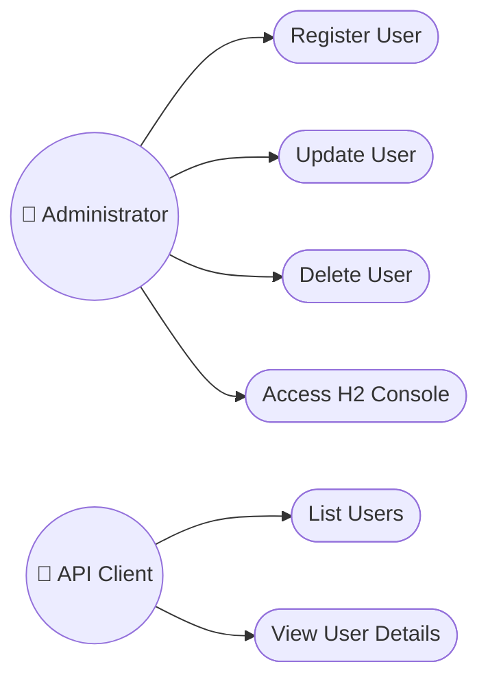

### UC01 — Register User

| Field | Description |
|:------|:-------------|
| **Actor** | Administrator |
| **Description** | Creates a new user record in the system. |
| **Preconditions** | None |
| **Main Flow** | 1. Actor sends `POST /users` with user data.<br>2. System validates required fields.<br>3. System persists the new `User`.<br>4. System returns `201 Created` with the resource. |
| **Alternative Flow** | If `email` already exists → returns `409 Conflict`. |
| **Postconditions** | A new row is added to `tb_user`. |

### UC02 — List Users

| Field | Description |
|:------|:-------------|
| **Actor** | API Client |
| **Description** | Retrieves all registered users. |
| **Preconditions** | None |
| **Main Flow** | 1. Actor sends `GET /users`.<br>2. System queries `tb_user` via `UserRepository`.<br>3. System returns `200 OK` with a JSON list. |
| **Alternative Flow** | If no users exist → returns an empty array. |
| **Postconditions** | None (read-only) |

### UC05 — Delete User

| Field | Description |
|:------|:-------------|
| **Actor** | Administrator |
| **Description** | Removes a user from the system permanently. |
| **Preconditions** | User with given `id` must exist. |
| **Main Flow** | 1. Actor sends `DELETE /users/{id}`.<br>2. System checks existence.<br>3. System deletes the record.<br>4. System returns `204 No Content`. |
| **Alternative Flow** | If `id` not found → returns `404 Not Found`. |
| **Postconditions** | The row is removed from `tb_user`. |

</details>

---

## 3. Requirements Traceability Matrix

<details>
<summary><strong>🔗 RF ↔ Use Case ↔ Component ↔ Diagram</strong></summary>

| Requirement | Use Case | Implementing Component | Related Diagram |
|:------------|:---------|:------------------------|:-----------------|
| RF01 | UC02 - List Users | `UserResource.findAll()` | Sequence, Class |
| RF02 | UC03 - View User Details | `UserResource.findById()` | Sequence, Class |
| RF03 | UC01 - Register User | `UserResource.insert()` | Activity, Sequence |
| RF04 | UC04 - Update User | `UserResource.update()` | State Machine |
| RF05 | UC05 - Delete User | `UserResource.delete()` | State Machine |
| RF06 | UC06 - Access H2 Console | `application.properties` | Deployment |
| RF07 | All CRUD use cases | `User`, `UserRepository` | ER Diagram, Class |

</details>

---

## 4. Software Requirements Specification (SRS)

<details>
<summary><strong>📄 Full SRS Document</strong></summary>

### 4.1 Introduction
This document specifies the requirements for the **User Management module** of the
Workshop Spring Boot 3 & JPA project. It targets developers, evaluators and students
studying layered architecture with Spring Boot.

### 4.2 Overall Description
The system is a single-module REST API exposing CRUD operations over a `User` resource,
persisted to an H2 in-memory relational database through Spring Data JPA.

### 4.3 System Features
- **Feature 1 — User Listing** (RF01): returns all users as JSON.
- **Feature 2 — User Retrieval** (RF02): returns a single user by ID.
- **Feature 3 — User Creation** (RF03): persists a new user.
- **Feature 4 — User Update** (RF04): updates an existing user's fields.
- **Feature 5 — User Deletion** (RF05): removes a user by ID.

### 4.4 External Interface Requirements
- **User Interfaces**: H2 web console (`/h2-console`).
- **Software Interfaces**: REST/JSON consumed via HTTP clients.
- **Communication Interfaces**: HTTP/1.1 over TCP, port 8080.

### 4.5 Non-Functional Requirements
See [1.2 Non-Functional Requirements](#1-requirements).

### 4.6 Constraints
- Must run on Java 17+.
- Must use Spring Boot 3.x and Spring Data JPA.
- Database must remain H2 (in-memory) for the workshop scope.

</details>

---

## 5. UML & Structural Diagrams

<details>
<summary><strong>🧱 5.1 Class Diagram</strong></summary>

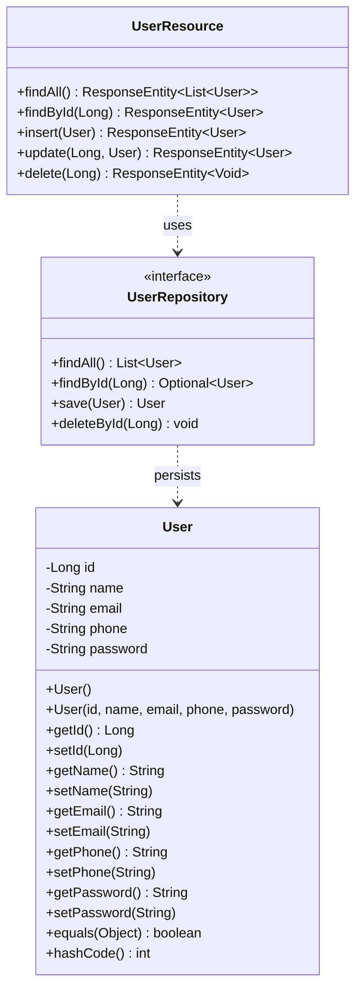

</details>

<details>
<summary><strong>🧩 5.2 Object Diagram</strong></summary>

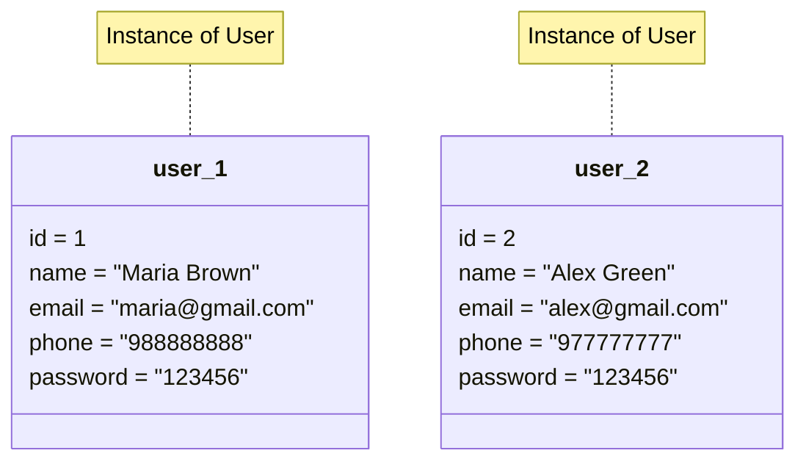

</details>

<details>
<summary><strong>🔁 5.3 Sequence Diagram — GET /users</strong></summary>

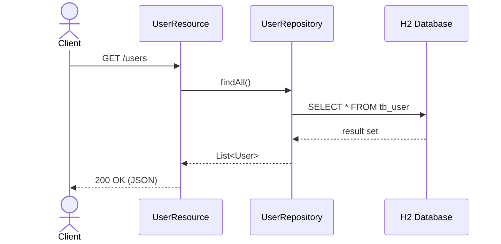

</details>

<details>
<summary><strong>💬 5.4 Communication (Collaboration) Diagram</strong></summary>

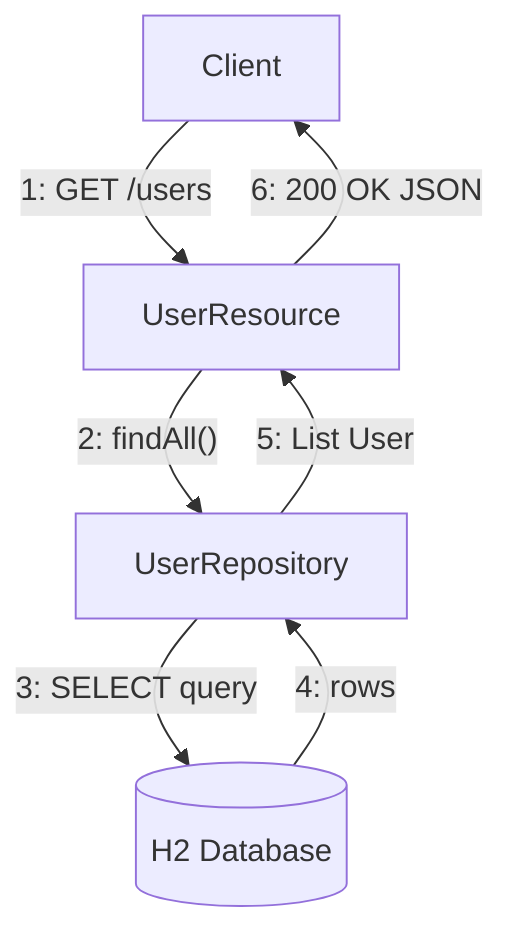

</details>

<details>
<summary><strong>🔄 5.5 Activity Diagram — Create User</strong></summary>

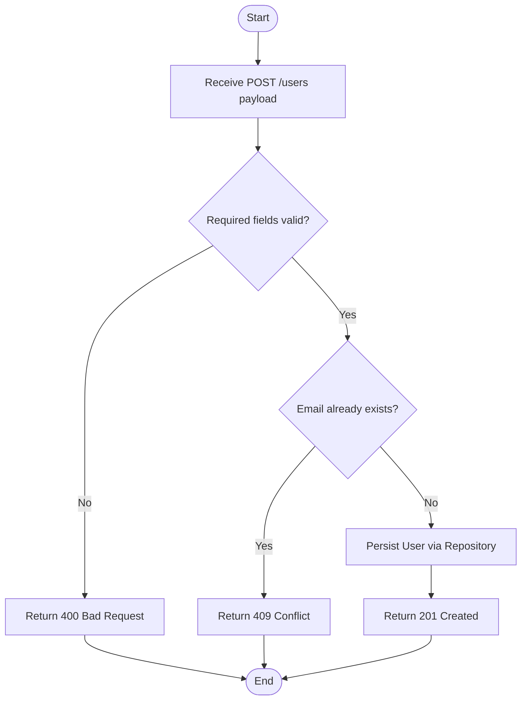

</details>

<details>
<summary><strong>🟢 5.6 State Machine Diagram — User Lifecycle</strong></summary>

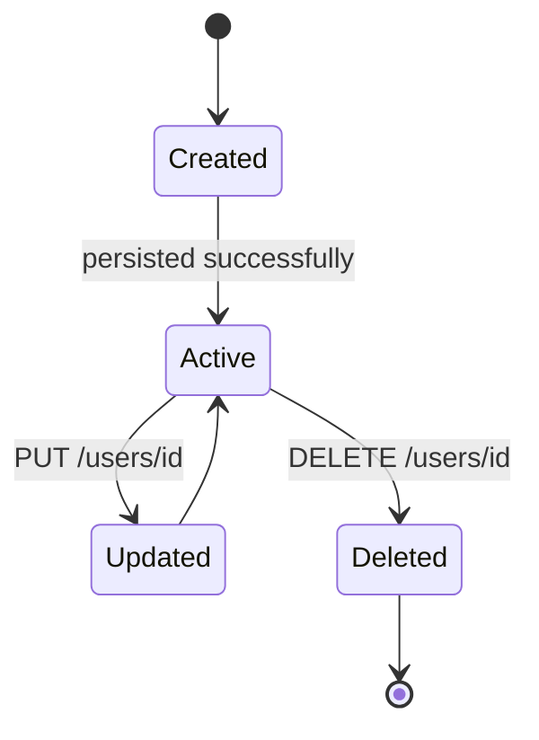

</details>

<details>
<summary><strong>📦 5.7 Component Diagram</strong></summary>

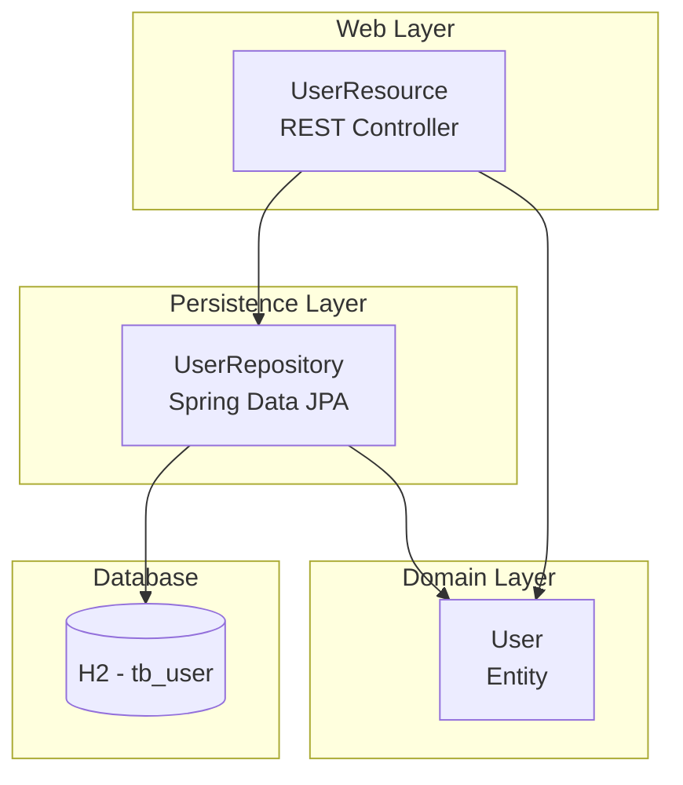

</details>

<details>
<summary><strong>🖥️ 5.8 Deployment Diagram</strong></summary>

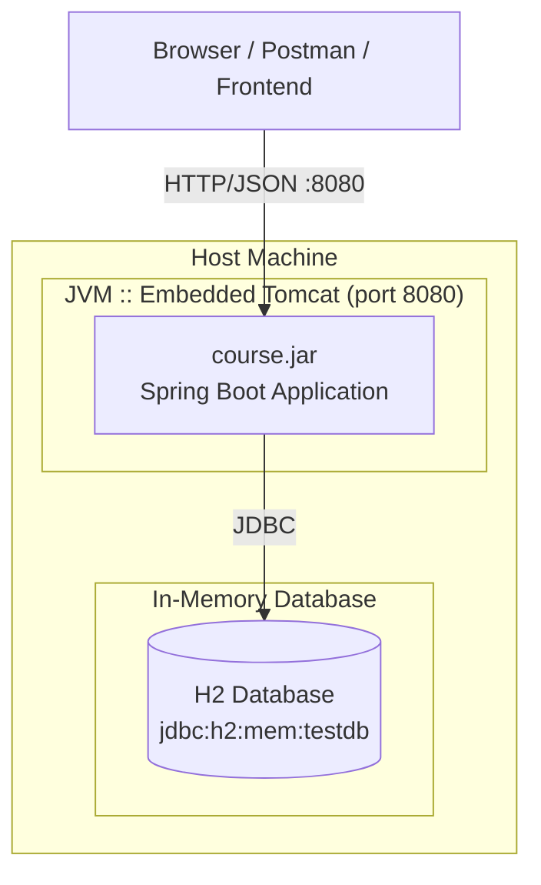

</details>

<details>
<summary><strong>📂 5.9 Package Diagram</strong></summary>

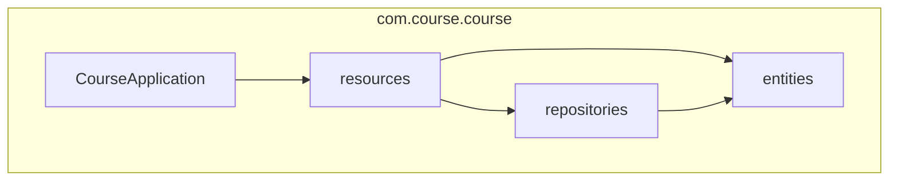

</details>

<details>
<summary><strong>🧬 5.10 Composite Structure Diagram — UserResource</strong></summary>

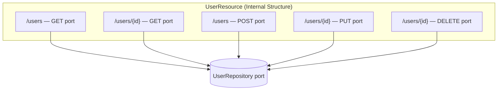

</details>

<details>
<summary><strong>🌀 5.11 Interaction Overview Diagram</strong></summary>

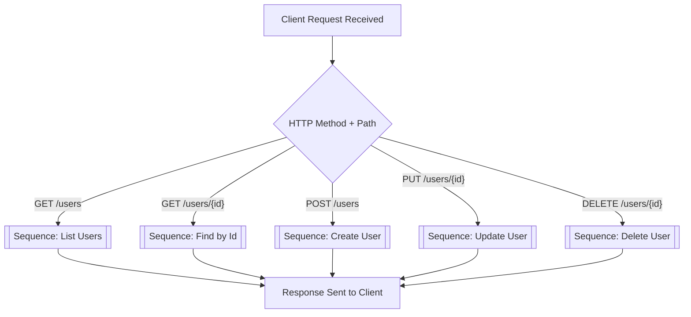

</details>

<details>
<summary><strong>⏱️ 5.12 Timing Diagram — Request Lifecycle</strong></summary>

| Time → | t0 | t1 | t2 | t3 | t4 |
|:-------|:--:|:--:|:--:|:--:|:--:|
| **Client** | `REQUEST sent` | idle | idle | idle | `RESPONSE received` |
| **UserResource** | idle | `RECEIVED` | `PROCESSING` | `RETURNING` | idle |
| **UserRepository** | idle | idle | `QUERY` | `RESULT` | idle |
| **H2 Database** | idle | idle | `EXECUTE SELECT` | idle | idle |

</details>

---

## 6. Data Model & Data Dictionary

<details>
<summary><strong>🗄️ 6.1 Entity-Relationship Diagram (ER)</strong></summary>

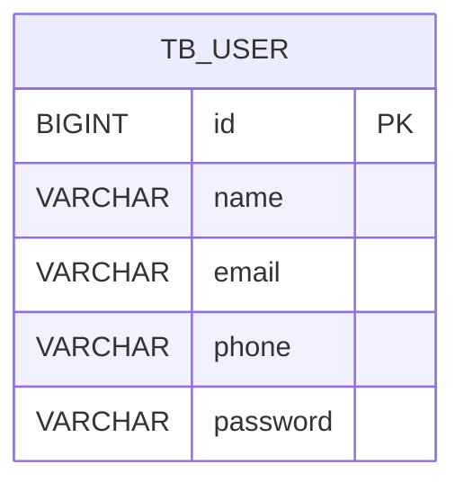

</details>

<details>
<summary><strong>🧠 6.2 Conceptual Model</strong></summary>

> At the conceptual level, the domain revolves around a single entity, **User**, representing
> any person who interacts with the system. Future iterations may relate `User` to `Order`
> and `Role` entities.

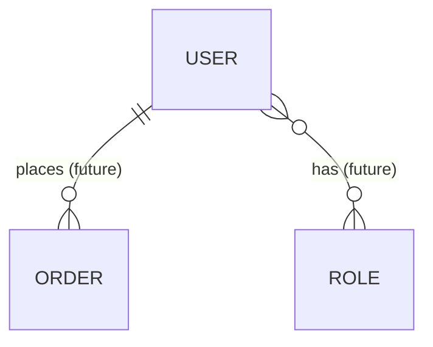

</details>

<details>
<summary><strong>🔎 6.3 Logical Model</strong></summary>

| Entity | Attribute | Type | Key |
|:-------|:----------|:-----|:----|
| User | id | Integer | PK |
| User | name | Text | — |
| User | email | Text | Unique |
| User | phone | Text | — |
| User | password | Text | — |

</details>

<details>
<summary><strong>⚙️ 6.4 Physical Model</strong></summary>

```sql
CREATE TABLE tb_user (
    id       BIGINT AUTO_INCREMENT PRIMARY KEY,
    name     VARCHAR(100) NOT NULL,
    email    VARCHAR(100) NOT NULL UNIQUE,
    phone    VARCHAR(20),
    password VARCHAR(100) NOT NULL
);
```

</details>

<details>
<summary><strong>📚 6.5 Data Dictionary</strong></summary>

| Table | Column | Type | Null? | Description |
|:------|:-------|:-----|:-----:|:------------|
| `tb_user` | `id` | `BIGINT` | No | Surrogate primary key, auto-increment |
| `tb_user` | `name` | `VARCHAR(100)` | No | Full name of the user |
| `tb_user` | `email` | `VARCHAR(100)` | No | Unique e-mail address, used as login candidate |
| `tb_user` | `phone` | `VARCHAR(20)` | Yes | Contact phone number |
| `tb_user` | `password` | `VARCHAR(100)` | No | User password (plain text now, hashed in future) |

</details>

---

## 7. Data Flow Diagram (DFD)

<details>
<summary><strong>🔀 7.1 DFD Level 0 (Context)</strong></summary>

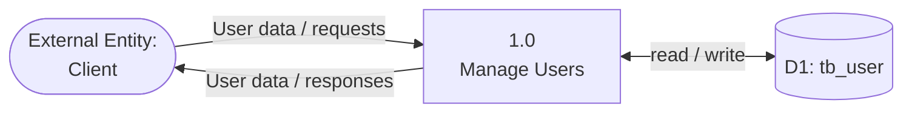

</details>

<details>
<summary><strong>🔀 7.2 DFD Level 1 (Detailed)</strong></summary>

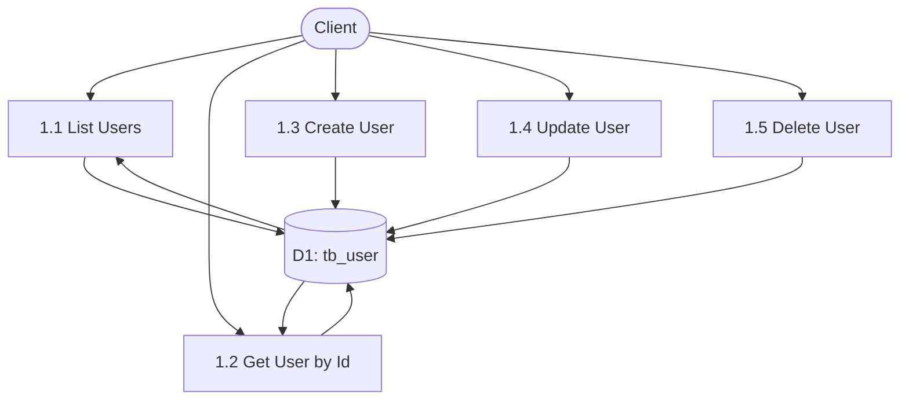

</details>

<details>
<summary><strong>🧵 7.3 Data Lineage Diagram</strong></summary>

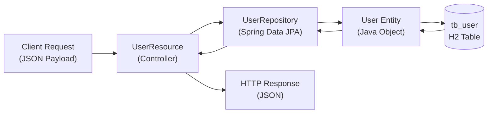

</details>

---

## 8. Architecture Diagram & Flowchart

<details>
<summary><strong>🏗️ 8.1 Layered Architecture</strong></summary>

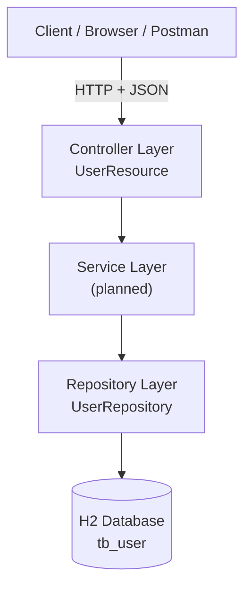

</details>

<details>
<summary><strong>🔁 8.2 Application Flowchart — Request Handling</strong></summary>

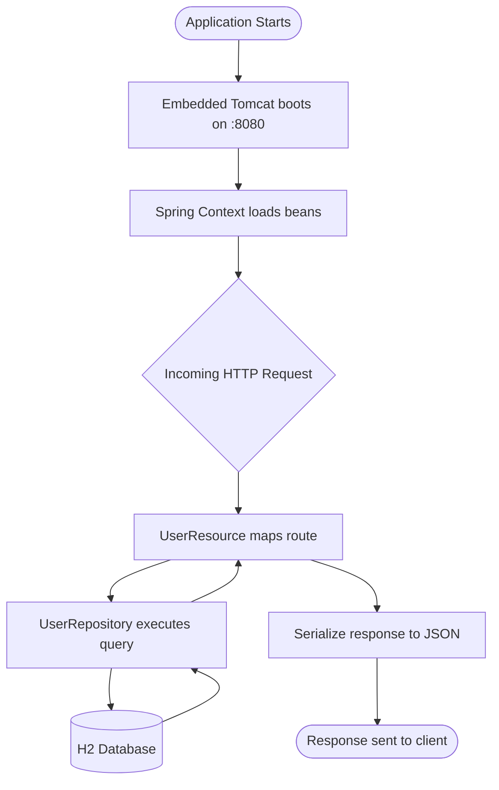

</details>

---

## 9. Persona & User Journey Map

<details>
<summary><strong>🧑‍💼 9.1 Persona</strong></summary>

| Attribute | Description |
|:----------|:-------------|
| **Name** | Maria Brown |
| **Role** | Backend Developer / API Consumer |
| **Age** | 29 |
| **Goals** | Quickly test CRUD operations for the User module via REST client. |
| **Frustrations** | Lack of API documentation; unclear error messages. |
| **Tech Proficiency** | High — comfortable with Postman, JSON, HTTP status codes. |
| **Needs** | Predictable endpoints, consistent JSON structure, clear status codes. |

</details>

<details>
<summary><strong>🗺️ 9.2 User Journey Map</strong></summary>

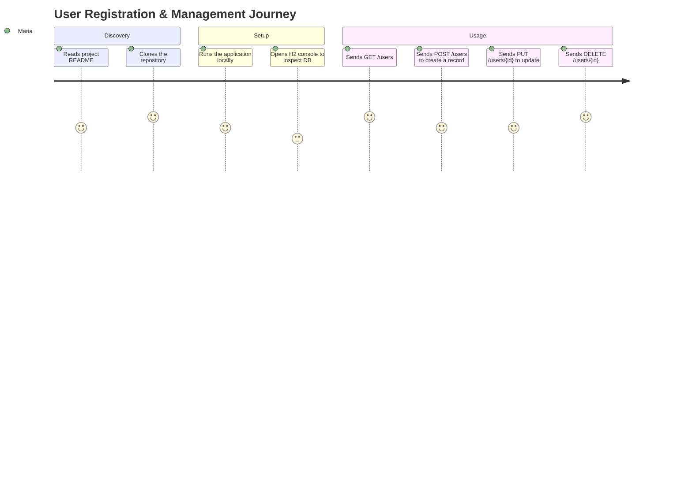

</details>

---

## 10. Wireframes & Mockups

<details>
<summary><strong>🎨 10.1 User List Screen (Wireframe)</strong></summary>

```
┌──────────────────────────────────────────────┐
│  Users                                  [ + ] │
├──────────────────────────────────────────────┤
│  ID │ Name          │ Email          │ Phone  │
├─────┼───────────────┼────────────────┼────────┤
│  1  │ Maria Brown   │ maria@mail.com │ 98888  │
│  2  │ Alex Green    │ alex@mail.com  │ 97777  │
├──────────────────────────────────────────────┤
│              [Edit]   [Delete]                │
└──────────────────────────────────────────────┘
```

</details>

<details>
<summary><strong>📝 10.2 User Form (Create / Edit) — Mockup</strong></summary>

```
┌──────────────────────────────────────────────┐
│  New User                                     │
├──────────────────────────────────────────────┤
│  Name     [____________________________]     │
│  Email    [____________________________]     │
│  Phone    [____________________________]     │
│  Password [____________________________]     │
│                                                │
│              [ Cancel ]   [ Save ]            │
└──────────────────────────────────────────────┘
```

</details>

---

## 🚀 Installation & Execution

### ✅ Prerequisites

| Requirement | Detail |
|:------------|:--------|
| **Java (JDK)** | Version **17 or higher** |
| **Build Tool** | Gradle Wrapper (`gradlew`) included — no global install needed |
| **IDE** | IntelliJ IDEA, Eclipse or VS Code (recommended) |

### 🔧 Steps

```bash
# 1. Clone the repository
git clone https://github.com/VictorHJesusSantiago/workshop-springboot3-jpa.git
cd workshop-springboot3-jpa

# 2. Run the application
# Linux / macOS
./gradlew bootRun

# Windows
.\gradlew.bat bootRun
```

### 🛰️ Endpoints

| Service | URL |
|:--------|:----|
| 👤 Users API | `http://localhost:8080/users` |
| 🖥️ H2 Console | `http://localhost:8080/h2-console` |

**H2 Console credentials:**

| Field | Value |
|:------|:------|
| JDBC URL | `jdbc:h2:mem:testdb` |
| Username | `sa` |
| Password | *(leave blank)* |

---

## 👨‍💻 Author

<div align="center">

**Victor Henrique de Jesus Santiago**
Full Stack Developer

[](mailto:victorhenriquedejesussantiago@gmail.com)
[](https://www.linkedin.com/in/victor-henrique-de-jesus-santiago/)
[](https://github.com/VictorHJesusSantiago)

</div>
