<div align="center">


# 🚀 Workshop Spring Boot 3 & JPA

### API REST de Gestión de Usuarios — Documentación Completa de Ingeniería

Un proyecto educativo con Spring Boot 3 + Spring Data JPA + H2, documentado de extremo a extremo
con requisitos, diagramas UML, modelado de datos, DFD, arquitectura, personas y wireframes.


### 🌐 Choose Language / Selecione o idioma / Elija el idioma

[](./README.md)
[](./README_PT.md)
[](./README_ES.md)

</div>

---

## 📘 Sobre el Proyecto

> Este proyecto es un **workshop práctico** para construir una API RESTful con **Spring Boot 3**
> y **Spring Data JPA**, respaldada por una base de datos **H2 en memoria**. Su funcionalidad
> principal actual es un **recurso de Usuario** expuesto vía HTTP/JSON, diseñado como base para
> un módulo CRUD completo.
>
> Este README documenta el proyecto de la misma forma en que se especificaría un producto de
> software real: requisitos, casos de uso, trazabilidad, SRS, diagramas UML, diccionario de
> datos, flujo de datos, arquitectura, personas, recorridos de usuario y wireframes de interfaz.

---

## 📑 Tabla de Contenidos

- [1. Requisitos](#1-requisitos)
- [2. Casos de Uso](#2-casos-de-uso)
- [3. Matriz de Trazabilidad de Requisitos](#3-matriz-de-trazabilidad-de-requisitos)
- [4. Especificación de Requisitos de Software (SRS)](#4-especificación-de-requisitos-de-software-srs)
- [5. Diagramas UML y Estructurales](#5-diagramas-uml-y-estructurales)
- [6. Modelo de Datos y Diccionario de Datos](#6-modelo-de-datos-y-diccionario-de-datos)
- [7. Diagrama de Flujo de Datos (DFD)](#7-diagrama-de-flujo-de-datos-dfd)
- [8. Diagrama de Arquitectura y Flujograma](#8-diagrama-de-arquitectura-y-flujograma)
- [9. Persona y Mapa de Recorrido del Usuario](#9-persona-y-mapa-de-recorrido-del-usuario)
- [10. Wireframes y Mockups](#10-wireframes-y-mockups)
- [🚀 Instalación y Ejecución](#-instalación-y-ejecución)
- [👨‍💻 Autor](#-autor)

---

## 1. Requisitos

<details>
<summary><strong>📕 1.1 Requisitos Funcionales (RF)</strong></summary>

| ID | Requisito | Prioridad |
|:---|:------------|:--------:|
| **RF01** | El sistema debe listar todos los usuarios registrados (`GET /users`). | Alta |
| **RF02** | El sistema debe obtener un usuario específico por ID (`GET /users/{id}`). | Alta |
| **RF03** | El sistema debe permitir crear un nuevo usuario (`POST /users`). | Alta |
| **RF04** | El sistema debe permitir actualizar los datos de un usuario existente (`PUT /users/{id}`). | Media |
| **RF05** | El sistema debe permitir eliminar un usuario por ID (`DELETE /users/{id}`). | Media |
| **RF06** | El sistema debe proporcionar una consola web para inspeccionar la base H2 (`/h2-console`). | Baja |
| **RF07** | El sistema debe persistir las entidades `User` en la tabla `tb_user` vía JPA. | Alta |

</details>

<details>
<summary><strong>📗 1.2 Requisitos No Funcionales (RNF)</strong></summary>

| ID | Requisito | Categoría |
|:---|:------------|:---------|
| **RNF01** | Las respuestas de la API deben devolverse en formato JSON. | Usabilidad |
| **RNF02** | La aplicación debe iniciar con un servidor Tomcat embebido en el puerto `8080`. | Portabilidad |
| **RNF03** | La base de datos debe ejecutarse en memoria (H2), sin configuración externa. | Despliegue |
| **RNF04** | El código debe seguir una arquitectura en capas (Entidad / Repositorio / Resource). | Mantenibilidad |
| **RNF05** | El sistema debe funcionar en Java 17+ y Spring Boot 3.x. | Compatibilidad |
| **RNF06** | El tiempo medio de respuesta para consultas simples debe ser inferior a 200ms en desarrollo. | Rendimiento |
| **RNF07** | Las contraseñas no deben exponerse en los logs (futuro: hashing con BCrypt). | Seguridad |

</details>

<details>
<summary><strong>📙 1.3 Reglas de Negocio (RN)</strong></summary>

| ID | Regla |
|:---|:-----|
| **RN01** | Cada usuario debe tener una dirección de `email` única. |
| **RN02** | El campo `id` es generado automáticamente por la base de datos y es inmutable. |
| **RN03** | Los campos `name` y `email` son obligatorios y no pueden estar vacíos. |
| **RN04** | Un usuario no puede eliminarse si está referenciado por otras entidades (futuro: Pedidos). |
| **RN05** | La actualización de un usuario no puede modificar su `id`. |

</details>

<details>
<summary><strong>📒 1.4 Requisitos de Dominio</strong></summary>

| Término | Definición |
|:-----|:-----------|
| **User (Usuario)** | Persona registrada en el sistema, identificada por id, nombre, email, teléfono y contraseña. |
| **Resource (Controller)** | Componente Spring responsable de exponer endpoints REST (`UserResource`). |
| **Repository** | Interfaz Spring Data JPA responsable de las operaciones de persistencia de `User`. |
| **Entity** | Clase Java mapeada a una tabla relacional mediante anotaciones JPA. |
| **DTO** | Data Transfer Object — capa futura para desacoplar entidades de los payloads de la API. |

</details>

<details>
<summary><strong>📓 1.5 Requisitos de Datos</strong></summary>

| Campo | Tipo | Restricción |
|:------|:-----|:-----------|
| `id` | `Long` | Clave primaria, autoincremental |
| `name` | `String` | Obligatorio, máx. 100 caracteres |
| `email` | `String` | Obligatorio, único, formato de correo válido |
| `phone` | `String` | Opcional, formato numérico |
| `password` | `String` | Obligatorio, almacenado de forma segura (futuro: hash) |

</details>

<details>
<summary><strong>📔 1.6 Requisitos de Interfaz</strong></summary>

| Interfaz | Descripción |
|:----------|:-------------|
| **API REST (JSON sobre HTTP)** | Interfaz principal consumida por clientes (Postman, apps frontend). |
| **Consola Web H2** | Interfaz en el navegador en `/h2-console` para inspeccionar la base de datos. |
| **Swagger / OpenAPI (planificado)** | Documentación interactiva futura de la API. |

</details>

---

## 2. Casos de Uso

<details>
<summary><strong>🧩 Diagrama de Casos de Uso y Especificaciones</strong></summary>

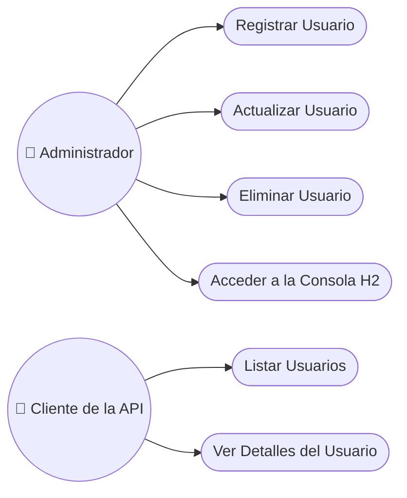

### UC01 — Registrar Usuario

| Campo | Descripción |
|:------|:-------------|
| **Actor** | Administrador |
| **Descripción** | Crea un nuevo registro de usuario en el sistema. |
| **Precondiciones** | Ninguna |
| **Flujo Principal** | 1. El actor envía `POST /users` con los datos del usuario.<br>2. El sistema valida los campos obligatorios.<br>3. El sistema persiste el nuevo `User`.<br>4. El sistema devuelve `201 Created` con el recurso. |
| **Flujo Alternativo** | Si el `email` ya existe → devuelve `409 Conflict`. |
| **Postcondiciones** | Se agrega una nueva fila a `tb_user`. |

### UC02 — Listar Usuarios

| Campo | Descripción |
|:------|:-------------|
| **Actor** | Cliente de la API |
| **Descripción** | Recupera todos los usuarios registrados. |
| **Precondiciones** | Ninguna |
| **Flujo Principal** | 1. El actor envía `GET /users`.<br>2. El sistema consulta `tb_user` vía `UserRepository`.<br>3. El sistema devuelve `200 OK` con una lista JSON. |
| **Flujo Alternativo** | Si no existen usuarios → devuelve un array vacío. |
| **Postcondiciones** | Ninguna (solo lectura) |

### UC05 — Eliminar Usuario

| Campo | Descripción |
|:------|:-------------|
| **Actor** | Administrador |
| **Descripción** | Elimina un usuario del sistema de forma permanente. |
| **Precondiciones** | El usuario con el `id` indicado debe existir. |
| **Flujo Principal** | 1. El actor envía `DELETE /users/{id}`.<br>2. El sistema verifica su existencia.<br>3. El sistema elimina el registro.<br>4. El sistema devuelve `204 No Content`. |
| **Flujo Alternativo** | Si el `id` no se encuentra → devuelve `404 Not Found`. |
| **Postcondiciones** | La fila se elimina de `tb_user`. |

</details>

---

## 3. Matriz de Trazabilidad de Requisitos

<details>
<summary><strong>🔗 RF ↔ Caso de Uso ↔ Componente ↔ Diagrama</strong></summary>

| Requisito | Caso de Uso | Componente que lo Implementa | Diagrama Relacionado |
|:------------|:---------|:------------------------|:-----------------|
| RF01 | UC02 - Listar Usuarios | `UserResource.findAll()` | Secuencia, Clases |
| RF02 | UC03 - Ver Detalles | `UserResource.findById()` | Secuencia, Clases |
| RF03 | UC01 - Registrar Usuario | `UserResource.insert()` | Actividades, Secuencia |
| RF04 | UC04 - Actualizar Usuario | `UserResource.update()` | Máquina de Estados |
| RF05 | UC05 - Eliminar Usuario | `UserResource.delete()` | Máquina de Estados |
| RF06 | UC06 - Acceder a la Consola H2 | `application.properties` | Implementación |
| RF07 | Todos los casos de uso CRUD | `User`, `UserRepository` | DER, Clases |

</details>

---

## 4. Especificación de Requisitos de Software (SRS)

<details>
<summary><strong>📄 Documento SRS Completo</strong></summary>

### 4.1 Introducción
Este documento especifica los requisitos del **módulo de Gestión de Usuarios** del
proyecto Workshop Spring Boot 3 & JPA. Está dirigido a desarrolladores, evaluadores y
estudiantes que estudian arquitectura en capas con Spring Boot.

### 4.2 Descripción General
El sistema es una API REST de un único módulo que expone operaciones CRUD sobre un recurso
`User`, persistido en una base de datos relacional H2 en memoria a través de Spring Data JPA.

### 4.3 Funcionalidades del Sistema
- **Funcionalidad 1 — Listado de Usuarios** (RF01): devuelve todos los usuarios en JSON.
- **Funcionalidad 2 — Búsqueda de Usuario** (RF02): devuelve un único usuario por ID.
- **Funcionalidad 3 — Creación de Usuario** (RF03): persiste un nuevo usuario.
- **Funcionalidad 4 — Actualización de Usuario** (RF04): actualiza los campos de un usuario existente.
- **Funcionalidad 5 — Eliminación de Usuario** (RF05): elimina un usuario por ID.

### 4.4 Requisitos de Interfaz Externa
- **Interfaces de Usuario**: consola web H2 (`/h2-console`).
- **Interfaces de Software**: REST/JSON consumido vía clientes HTTP.
- **Interfaces de Comunicación**: HTTP/1.1 sobre TCP, puerto 8080.

### 4.5 Requisitos No Funcionales
Ver [1.2 Requisitos No Funcionales](#1-requisitos).

### 4.6 Restricciones
- Debe ejecutarse en Java 17+.
- Debe usar Spring Boot 3.x y Spring Data JPA.
- La base de datos debe seguir siendo H2 (en memoria) para el alcance del workshop.

</details>

---

## 5. Diagramas UML y Estructurales

<details>
<summary><strong>🧱 5.1 Diagrama de Clases</strong></summary>

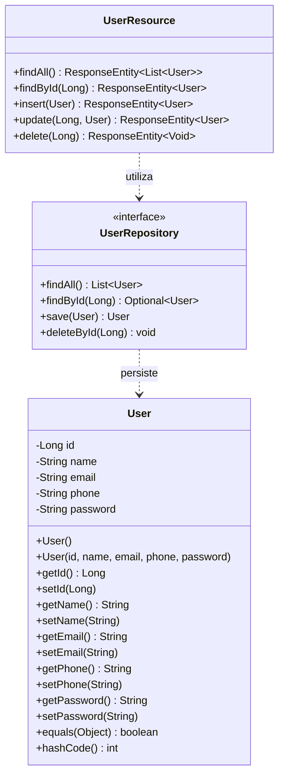

</details>

<details>
<summary><strong>🧩 5.2 Diagrama de Objetos</strong></summary>

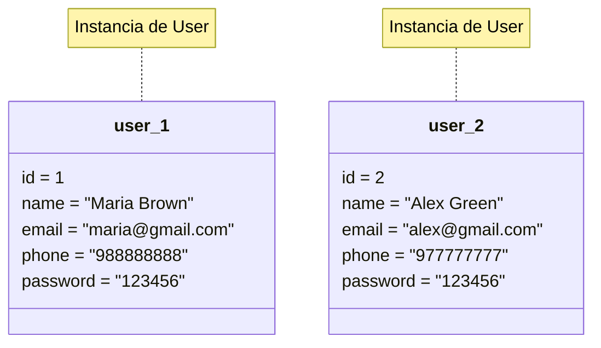

</details>

<details>
<summary><strong>🔁 5.3 Diagrama de Secuencia — GET /users</strong></summary>

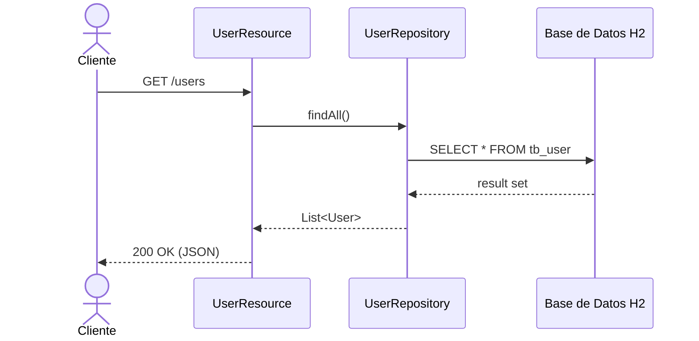

</details>

<details>
<summary><strong>💬 5.4 Diagrama de Comunicación (Colaboración)</strong></summary>

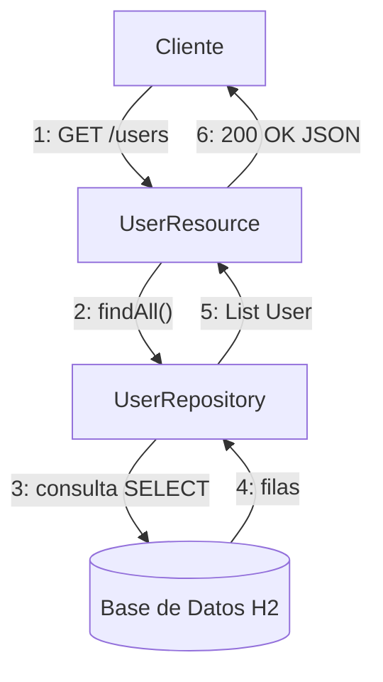

</details>

<details>
<summary><strong>🔄 5.5 Diagrama de Actividades — Registrar Usuario</strong></summary>

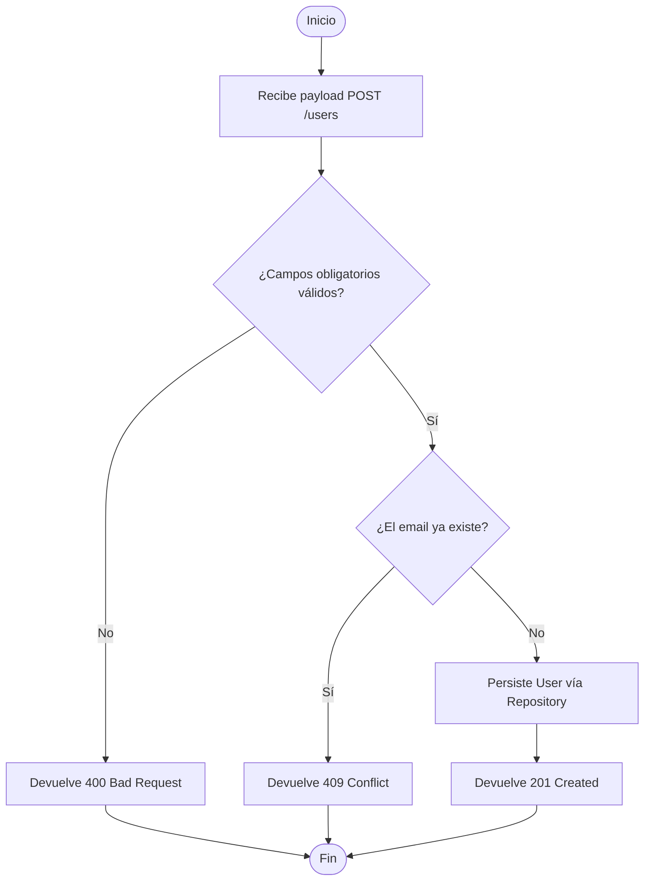

</details>

<details>
<summary><strong>🟢 5.6 Diagrama de Máquina de Estados — Ciclo de Vida del Usuario</strong></summary>

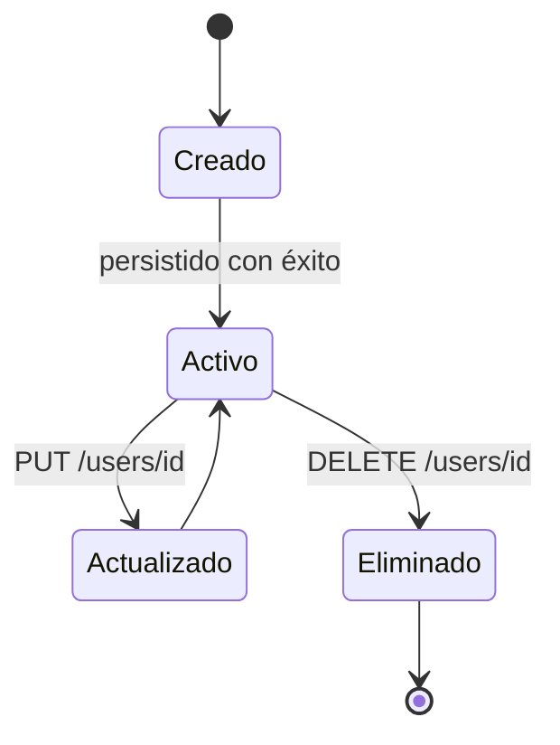

</details>

<details>
<summary><strong>📦 5.7 Diagrama de Componentes</strong></summary>

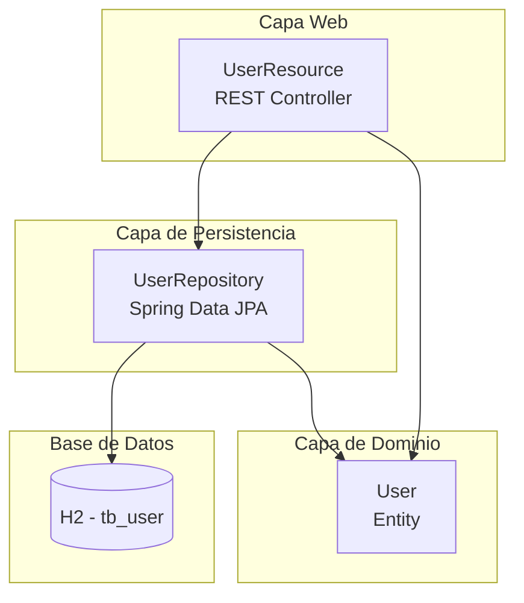

</details>

<details>
<summary><strong>🖥️ 5.8 Diagrama de Implementación (Deployment)</strong></summary>

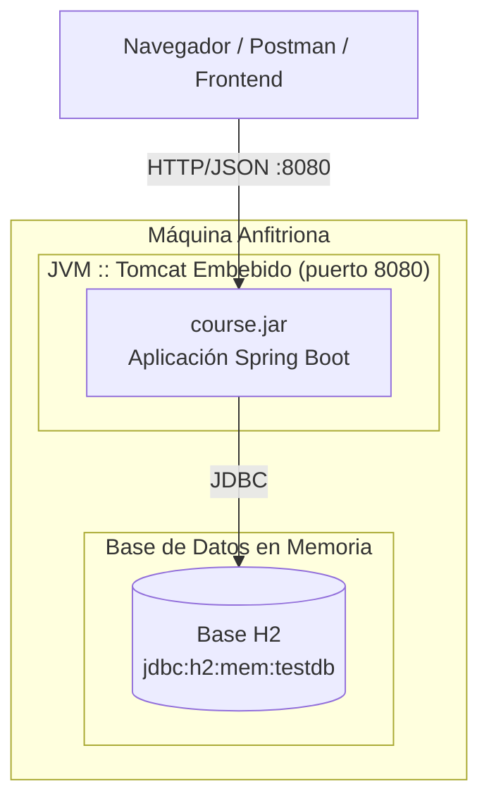

</details>

<details>
<summary><strong>📂 5.9 Diagrama de Paquetes</strong></summary>

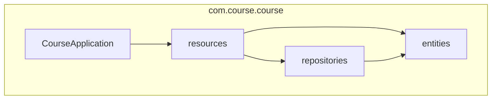

</details>

<details>
<summary><strong>🧬 5.10 Diagrama de Estructura Compuesta — UserResource</strong></summary>

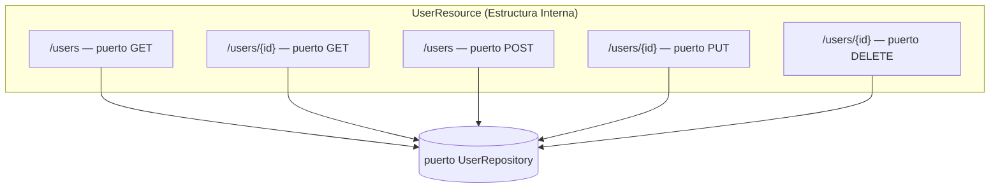

</details>

<details>
<summary><strong>🌀 5.11 Diagrama de Visión General de Interacción</strong></summary>

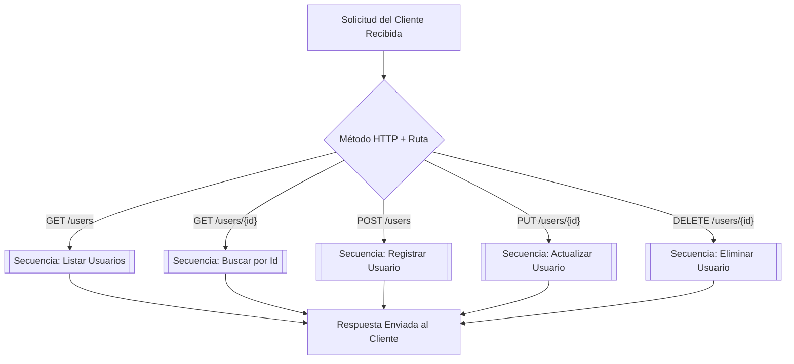

</details>

<details>
<summary><strong>⏱️ 5.12 Diagrama de Tiempo (Timing) — Ciclo de Vida de la Solicitud</strong></summary>

| Tiempo → | t0 | t1 | t2 | t3 | t4 |
|:-------|:--:|:--:|:--:|:--:|:--:|
| **Cliente** | `SOLICITUD enviada` | inactivo | inactivo | inactivo | `RESPUESTA recibida` |
| **UserResource** | inactivo | `RECIBIDO` | `PROCESANDO` | `RETORNANDO` | inactivo |
| **UserRepository** | inactivo | inactivo | `CONSULTA` | `RESULTADO` | inactivo |
| **Base de Datos H2** | inactivo | inactivo | `EJECUTA SELECT` | inactivo | inactivo |

</details>

---

## 6. Modelo de Datos y Diccionario de Datos

<details>
<summary><strong>🗄️ 6.1 Diagrama Entidad-Relación (DER)</strong></summary>

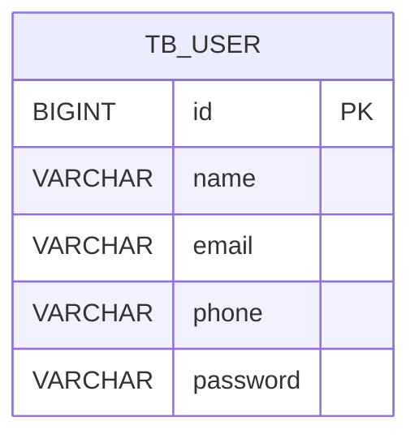

</details>

<details>
<summary><strong>🧠 6.2 Modelo Conceptual</strong></summary>

> A nivel conceptual, el dominio gira en torno a una única entidad, **User**, que representa
> a cualquier persona que interactúa con el sistema. Iteraciones futuras podrían relacionar
> `User` con las entidades `Order` (Pedido) y `Role` (Rol).

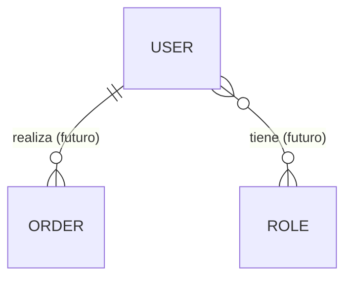

</details>

<details>
<summary><strong>🔎 6.3 Modelo Lógico</strong></summary>

| Entidad | Atributo | Tipo | Clave |
|:-------|:----------|:-----|:----|
| User | id | Entero | PK |
| User | name | Texto | — |
| User | email | Texto | Único |
| User | phone | Texto | — |
| User | password | Texto | — |

</details>

<details>
<summary><strong>⚙️ 6.4 Modelo Físico</strong></summary>

```sql
CREATE TABLE tb_user (
    id       BIGINT AUTO_INCREMENT PRIMARY KEY,
    name     VARCHAR(100) NOT NULL,
    email    VARCHAR(100) NOT NULL UNIQUE,
    phone    VARCHAR(20),
    password VARCHAR(100) NOT NULL
);
```

</details>

<details>
<summary><strong>📚 6.5 Diccionario de Datos</strong></summary>

| Tabla | Columna | Tipo | ¿Nulo? | Descripción |
|:------|:-------|:-----|:-----:|:------------|
| `tb_user` | `id` | `BIGINT` | No | Clave primaria sustituta, autoincremental |
| `tb_user` | `name` | `VARCHAR(100)` | No | Nombre completo del usuario |
| `tb_user` | `email` | `VARCHAR(100)` | No | Dirección de correo única, candidata a login |
| `tb_user` | `phone` | `VARCHAR(20)` | Sí | Número de teléfono de contacto |
| `tb_user` | `password` | `VARCHAR(100)` | No | Contraseña del usuario (texto plano hoy, hash en el futuro) |

</details>

---

## 7. Diagrama de Flujo de Datos (DFD)

<details>
<summary><strong>🔀 7.1 DFD Nivel 0 (Contexto)</strong></summary>

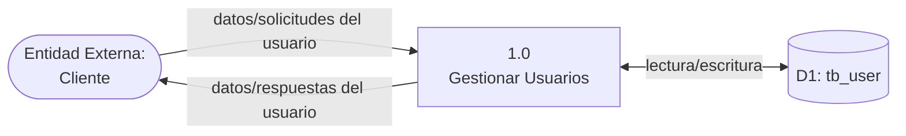

</details>

<details>
<summary><strong>🔀 7.2 DFD Nivel 1 (Detallado)</strong></summary>

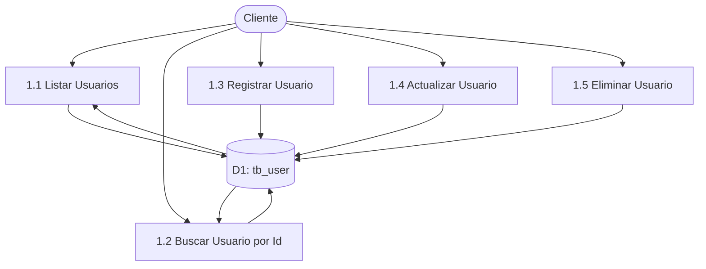

</details>

<details>
<summary><strong>🧵 7.3 Diagrama de Linaje de Datos (Data Lineage)</strong></summary>

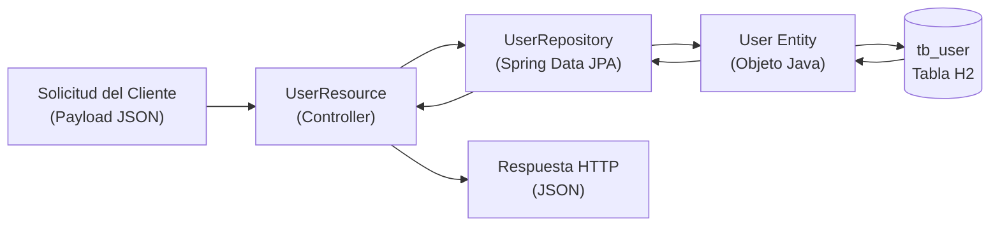

</details>

---

## 8. Diagrama de Arquitectura y Flujograma

<details>
<summary><strong>🏗️ 8.1 Arquitectura en Capas</strong></summary>

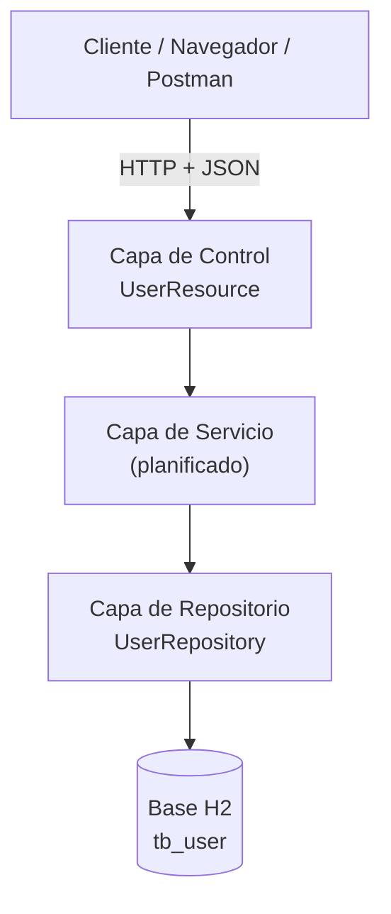

</details>

<details>
<summary><strong>🔁 8.2 Flujograma de la Aplicación — Manejo de Solicitudes</strong></summary>

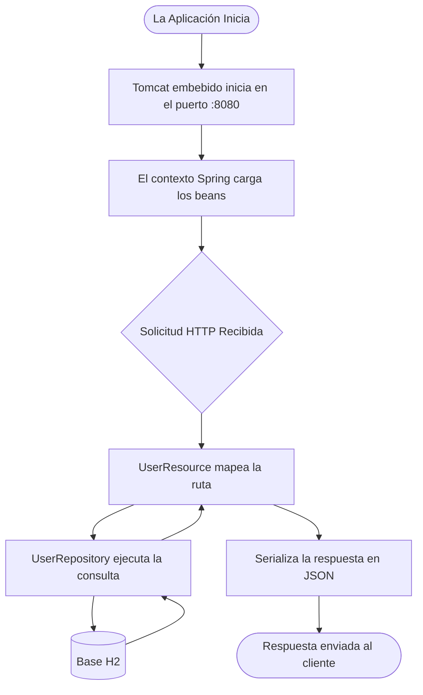

</details>

---

## 9. Persona y Mapa de Recorrido del Usuario

<details>
<summary><strong>🧑‍💼 9.1 Persona</strong></summary>

| Atributo | Descripción |
|:----------|:-------------|
| **Nombre** | Maria Brown |
| **Rol** | Desarrolladora Backend / Consumidora de la API |
| **Edad** | 29 |
| **Objetivos** | Probar rápidamente las operaciones CRUD del módulo de Usuario vía cliente REST. |
| **Frustraciones** | Falta de documentación de la API; mensajes de error poco claros. |
| **Competencia Técnica** | Alta — cómoda con Postman, JSON y códigos de estado HTTP. |
| **Necesidades** | Endpoints predecibles, estructura JSON consistente, códigos de estado claros. |

</details>

<details>
<summary><strong>🗺️ 9.2 Mapa de Recorrido del Usuario</strong></summary>

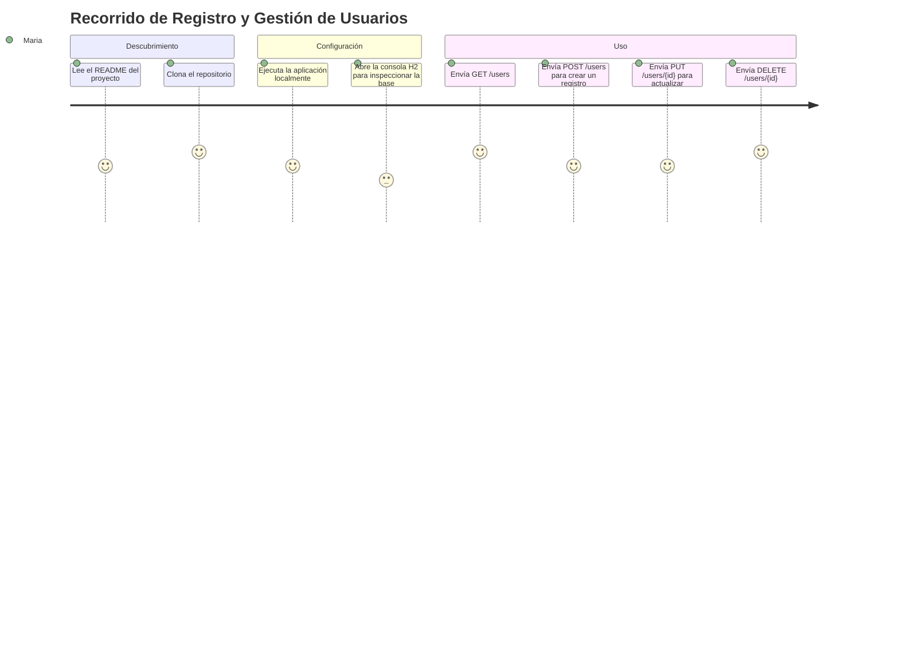

</details>

---

## 10. Wireframes y Mockups

<details>
<summary><strong>🎨 10.1 Pantalla de Listado de Usuarios (Wireframe)</strong></summary>

```
┌──────────────────────────────────────────────┐
│  Usuarios                               [ + ] │
├──────────────────────────────────────────────┤
│  ID │ Nombre        │ Email          │ Tel.   │
├─────┼───────────────┼────────────────┼────────┤
│  1  │ Maria Brown   │ maria@mail.com │ 98888  │
│  2  │ Alex Green    │ alex@mail.com  │ 97777  │
├──────────────────────────────────────────────┤
│              [Editar]   [Eliminar]            │
└──────────────────────────────────────────────┘
```

</details>

<details>
<summary><strong>📝 10.2 Formulario de Usuario (Crear / Editar) — Mockup</strong></summary>

```
┌──────────────────────────────────────────────┐
│  Nuevo Usuario                                │
├──────────────────────────────────────────────┤
│  Nombre    [____________________________]    │
│  Email     [____________________________]    │
│  Teléfono  [____________________________]    │
│  Contraseña[____________________________]    │
│                                                │
│              [ Cancelar ]   [ Guardar ]       │
└──────────────────────────────────────────────┘
```

</details>

---

## 🚀 Instalación y Ejecución

### ✅ Prerrequisitos

| Requisito | Detalle |
|:------------|:--------|
| **Java (JDK)** | Versión **17 o superior** |
| **Herramienta de Build** | Gradle Wrapper (`gradlew`) incluido — sin instalación global necesaria |
| **IDE** | IntelliJ IDEA, Eclipse o VS Code (recomendado) |

### 🔧 Pasos

```bash
# 1. Clona el repositorio
git clone https://github.com/VictorHJesusSantiago/workshop-springboot3-jpa.git
cd workshop-springboot3-jpa

# 2. Ejecuta la aplicación
# Linux / macOS
./gradlew bootRun

# Windows
.\gradlew.bat bootRun
```

### 🛰️ Endpoints

| Servicio | URL |
|:--------|:----|
| 👤 API de Usuarios | `http://localhost:8080/users` |
| 🖥️ Consola H2 | `http://localhost:8080/h2-console` |

**Credenciales de la Consola H2:**

| Campo | Valor |
|:------|:------|
| JDBC URL | `jdbc:h2:mem:testdb` |
| Usuario | `sa` |
| Contraseña | *(dejar en blanco)* |

---

## 👨‍💻 Autor

<div align="center">

**Victor Henrique de Jesus Santiago**
Full Stack Developer

[](mailto:victorhenriquedejesussantiago@gmail.com)
[](https://www.linkedin.com/in/victor-henrique-de-jesus-santiago/)
[](https://github.com/VictorHJesusSantiago)

</div>
