<div align="center">


# 🚀 Workshop Spring Boot 3 & JPA

### API REST de Gerenciamento de Usuários — Documentação Completa de Engenharia

Um projeto educacional com Spring Boot 3 + Spring Data JPA + H2, documentado de ponta a ponta
com requisitos, diagramas UML, modelagem de dados, DFD, arquitetura, personas e wireframes.


### 🌐 Choose Language / Selecione o idioma / Elija el idioma

[](./README.md)
[](./README_PT.md)
[](./README_ES.md)

</div>

---

## 📘 Sobre o Projeto

> Este projeto é um **workshop prático** para construção de uma API RESTful com **Spring Boot 3**
> e **Spring Data JPA**, utilizando um banco de dados **H2 em memória**. Sua funcionalidade
> principal atual é um **recurso de Usuário** exposto via HTTP/JSON, projetado como base para
> um módulo CRUD completo.
>
> Este README documenta o projeto da mesma forma que um produto de software real seria
> especificado: requisitos, casos de uso, rastreabilidade, SRS, diagramas UML, dicionário de
> dados, fluxo de dados, arquitetura, personas, jornadas e wireframes de interface.

---

## 📑 Sumário

- [1. Requisitos](#1-requisitos)
- [2. Casos de Uso](#2-casos-de-uso)
- [3. Matriz de Rastreabilidade de Requisitos](#3-matriz-de-rastreabilidade-de-requisitos)
- [4. Documento de Especificação de Requisitos de Software (SRS)](#4-documento-de-especificação-de-requisitos-de-software-srs)
- [5. Diagramas UML e Estruturais](#5-diagramas-uml-e-estruturais)
- [6. Modelo de Dados e Dicionário de Dados](#6-modelo-de-dados-e-dicionário-de-dados)
- [7. Diagrama de Fluxo de Dados (DFD)](#7-diagrama-de-fluxo-de-dados-dfd)
- [8. Diagrama de Arquitetura e Fluxograma](#8-diagrama-de-arquitetura-e-fluxograma)
- [9. Persona e Mapa de Jornada do Usuário](#9-persona-e-mapa-de-jornada-do-usuário)
- [10. Wireframes e Mockups](#10-wireframes-e-mockups)
- [🚀 Instalação e Execução](#-instalação-e-execução)
- [👨‍💻 Autor](#-autor)

---

## 1. Requisitos

<details>
<summary><strong>📕 1.1 Requisitos Funcionais (RF)</strong></summary>

| ID | Requisito | Prioridade |
|:---|:------------|:--------:|
| **RF01** | O sistema deve listar todos os usuários cadastrados (`GET /users`). | Alta |
| **RF02** | O sistema deve buscar um usuário específico por ID (`GET /users/{id}`). | Alta |
| **RF03** | O sistema deve permitir cadastrar um novo usuário (`POST /users`). | Alta |
| **RF04** | O sistema deve permitir atualizar os dados de um usuário existente (`PUT /users/{id}`). | Média |
| **RF05** | O sistema deve permitir excluir um usuário por ID (`DELETE /users/{id}`). | Média |
| **RF06** | O sistema deve fornecer um console web para inspecionar o banco H2 (`/h2-console`). | Baixa |
| **RF07** | O sistema deve persistir entidades `User` na tabela `tb_user` via JPA. | Alta |

</details>

<details>
<summary><strong>📗 1.2 Requisitos Não Funcionais (RNF)</strong></summary>

| ID | Requisito | Categoria |
|:---|:------------|:---------|
| **RNF01** | As respostas da API devem ser retornadas em formato JSON. | Usabilidade |
| **RNF02** | A aplicação deve iniciar com servidor Tomcat embutido na porta `8080`. | Portabilidade |
| **RNF03** | O banco de dados deve rodar em memória (H2), sem necessidade de configuração externa. | Implantação |
| **RNF04** | O código deve seguir arquitetura em camadas (Entidade / Repositório / Resource). | Manutenibilidade |
| **RNF05** | O sistema deve funcionar em Java 17+ e Spring Boot 3.x. | Compatibilidade |
| **RNF06** | O tempo médio de resposta para consultas simples deve ser inferior a 200ms em ambiente de dev. | Desempenho |
| **RNF07** | Senhas não devem ser expostas em logs (futuro: hashing com BCrypt). | Segurança |

</details>

<details>
<summary><strong>📙 1.3 Regras de Negócio (RN)</strong></summary>

| ID | Regra |
|:---|:-----|
| **RN01** | Cada usuário deve possuir um endereço de `email` único. |
| **RN02** | O campo `id` é gerado automaticamente pelo banco e é imutável. |
| **RN03** | Os campos `name` e `email` são obrigatórios e não podem ser vazios. |
| **RN04** | Um usuário não pode ser excluído se estiver referenciado por outras entidades (futuro: Pedidos). |
| **RN05** | A atualização de um usuário não pode alterar seu `id`. |

</details>

<details>
<summary><strong>📒 1.4 Requisitos de Domínio</strong></summary>

| Termo | Definição |
|:-----|:-----------|
| **User (Usuário)** | Pessoa cadastrada no sistema, identificada por id, nome, email, telefone e senha. |
| **Resource (Controller)** | Componente Spring responsável por expor endpoints REST (`UserResource`). |
| **Repository** | Interface Spring Data JPA responsável pelas operações de persistência de `User`. |
| **Entity** | Classe Java mapeada para uma tabela relacional via anotações JPA. |
| **DTO** | Data Transfer Object — camada futura para desacoplar entidades dos payloads da API. |

</details>

<details>
<summary><strong>📓 1.5 Requisitos de Dados</strong></summary>

| Campo | Tipo | Restrição |
|:------|:-----|:-----------|
| `id` | `Long` | Chave primária, auto-incremento |
| `name` | `String` | Obrigatório, máx. 100 caracteres |
| `email` | `String` | Obrigatório, único, formato de e-mail válido |
| `phone` | `String` | Opcional, formato numérico |
| `password` | `String` | Obrigatório, armazenado de forma segura (futuro: hash) |

</details>

<details>
<summary><strong>📔 1.6 Requisitos de Interface</strong></summary>

| Interface | Descrição |
|:----------|:-------------|
| **API REST (JSON sobre HTTP)** | Interface principal consumida por clientes (Postman, apps frontend). |
| **Console Web H2** | Interface no navegador em `/h2-console` para inspeção do banco. |
| **Swagger / OpenAPI (planejado)** | Documentação interativa futura da API. |

</details>

---

## 2. Casos de Uso

<details>
<summary><strong>🧩 Diagrama de Casos de Uso e Especificações</strong></summary>

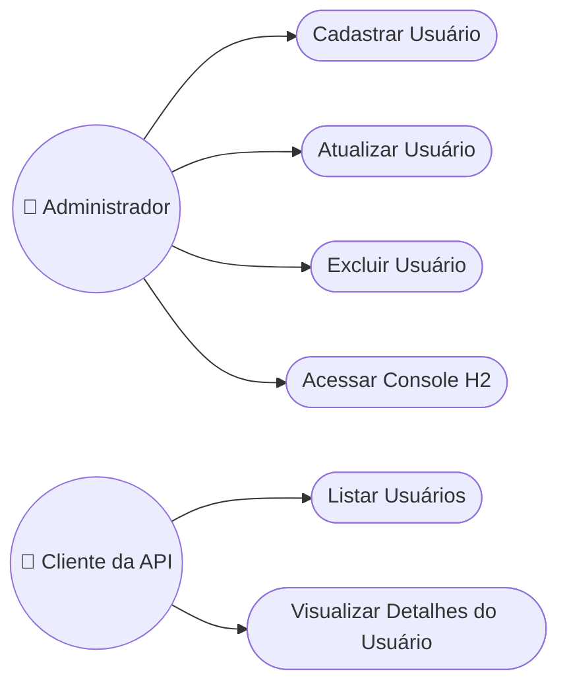

### UC01 — Cadastrar Usuário

| Campo | Descrição |
|:------|:-------------|
| **Ator** | Administrador |
| **Descrição** | Cria um novo registro de usuário no sistema. |
| **Pré-condições** | Nenhuma |
| **Fluxo Principal** | 1. Ator envia `POST /users` com os dados do usuário.<br>2. Sistema valida os campos obrigatórios.<br>3. Sistema persiste o novo `User`.<br>4. Sistema retorna `201 Created` com o recurso. |
| **Fluxo Alternativo** | Se o `email` já existir → retorna `409 Conflict`. |
| **Pós-condições** | Uma nova linha é adicionada à `tb_user`. |

### UC02 — Listar Usuários

| Campo | Descrição |
|:------|:-------------|
| **Ator** | Cliente da API |
| **Descrição** | Recupera todos os usuários cadastrados. |
| **Pré-condições** | Nenhuma |
| **Fluxo Principal** | 1. Ator envia `GET /users`.<br>2. Sistema consulta `tb_user` via `UserRepository`.<br>3. Sistema retorna `200 OK` com uma lista JSON. |
| **Fluxo Alternativo** | Se não houver usuários → retorna um array vazio. |
| **Pós-condições** | Nenhuma (somente leitura) |

### UC05 — Excluir Usuário

| Campo | Descrição |
|:------|:-------------|
| **Ator** | Administrador |
| **Descrição** | Remove um usuário do sistema permanentemente. |
| **Pré-condições** | O usuário com o `id` informado deve existir. |
| **Fluxo Principal** | 1. Ator envia `DELETE /users/{id}`.<br>2. Sistema verifica a existência.<br>3. Sistema exclui o registro.<br>4. Sistema retorna `204 No Content`. |
| **Fluxo Alternativo** | Se o `id` não for encontrado → retorna `404 Not Found`. |
| **Pós-condições** | A linha é removida da `tb_user`. |

</details>

---

## 3. Matriz de Rastreabilidade de Requisitos

<details>
<summary><strong>🔗 RF ↔ Caso de Uso ↔ Componente ↔ Diagrama</strong></summary>

| Requisito | Caso de Uso | Componente Implementador | Diagrama Relacionado |
|:------------|:---------|:------------------------|:-----------------|
| RF01 | UC02 - Listar Usuários | `UserResource.findAll()` | Sequência, Classes |
| RF02 | UC03 - Visualizar Detalhes | `UserResource.findById()` | Sequência, Classes |
| RF03 | UC01 - Cadastrar Usuário | `UserResource.insert()` | Atividades, Sequência |
| RF04 | UC04 - Atualizar Usuário | `UserResource.update()` | Máquina de Estados |
| RF05 | UC05 - Excluir Usuário | `UserResource.delete()` | Máquina de Estados |
| RF06 | UC06 - Acessar Console H2 | `application.properties` | Implantação |
| RF07 | Todos os casos de uso CRUD | `User`, `UserRepository` | DER, Classes |

</details>

---

## 4. Documento de Especificação de Requisitos de Software (SRS)

<details>
<summary><strong>📄 Documento SRS Completo</strong></summary>

### 4.1 Introdução
Este documento especifica os requisitos do **módulo de Gerenciamento de Usuários** do
projeto Workshop Spring Boot 3 & JPA. Destina-se a desenvolvedores, avaliadores e
estudantes que estudam arquitetura em camadas com Spring Boot.

### 4.2 Descrição Geral
O sistema é uma API REST de módulo único que expõe operações CRUD sobre um recurso `User`,
persistido em um banco de dados relacional H2 em memória através do Spring Data JPA.

### 4.3 Funcionalidades do Sistema
- **Funcionalidade 1 — Listagem de Usuários** (RF01): retorna todos os usuários em JSON.
- **Funcionalidade 2 — Busca de Usuário** (RF02): retorna um único usuário por ID.
- **Funcionalidade 3 — Cadastro de Usuário** (RF03): persiste um novo usuário.
- **Funcionalidade 4 — Atualização de Usuário** (RF04): atualiza os campos de um usuário existente.
- **Funcionalidade 5 — Exclusão de Usuário** (RF05): remove um usuário por ID.

### 4.4 Requisitos de Interface Externa
- **Interfaces de Usuário**: console web H2 (`/h2-console`).
- **Interfaces de Software**: REST/JSON consumido via clientes HTTP.
- **Interfaces de Comunicação**: HTTP/1.1 sobre TCP, porta 8080.

### 4.5 Requisitos Não Funcionais
Ver [1.2 Requisitos Não Funcionais](#1-requisitos).

### 4.6 Restrições
- Deve rodar em Java 17+.
- Deve usar Spring Boot 3.x e Spring Data JPA.
- O banco de dados deve permanecer H2 (em memória) para o escopo do workshop.

</details>

---

## 5. Diagramas UML e Estruturais

<details>
<summary><strong>🧱 5.1 Diagrama de Classes</strong></summary>

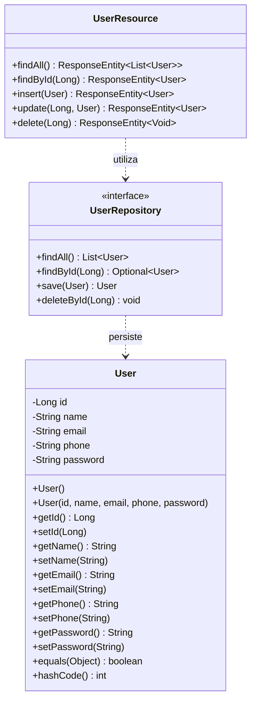

</details>

<details>
<summary><strong>🧩 5.2 Diagrama de Objetos</strong></summary>

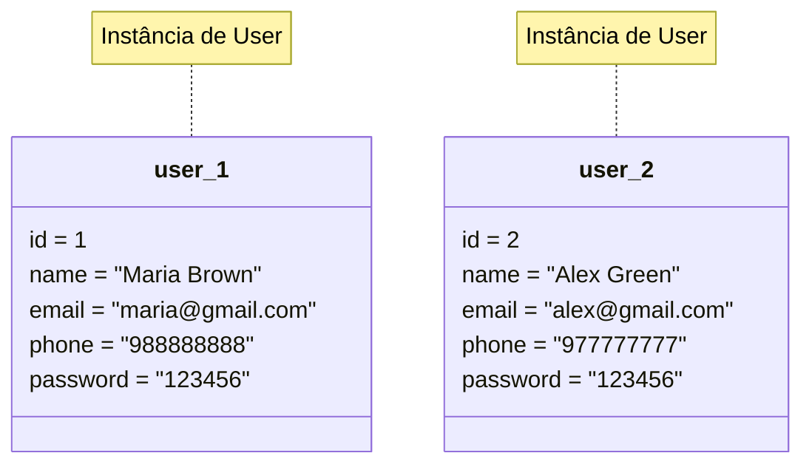

</details>

<details>
<summary><strong>🔁 5.3 Diagrama de Sequência — GET /users</strong></summary>

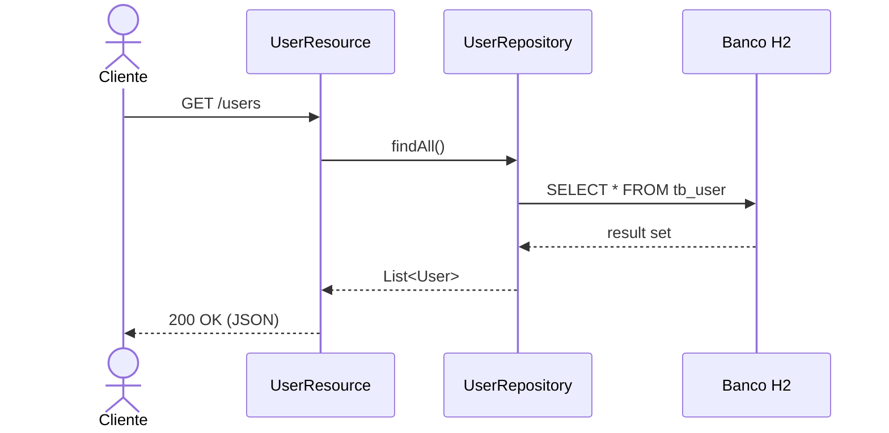

</details>

<details>
<summary><strong>💬 5.4 Diagrama de Comunicação (Colaboração)</strong></summary>

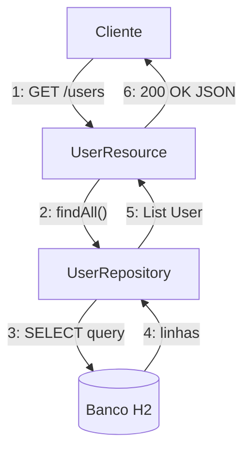

</details>

<details>
<summary><strong>🔄 5.5 Diagrama de Atividades — Cadastrar Usuário</strong></summary>

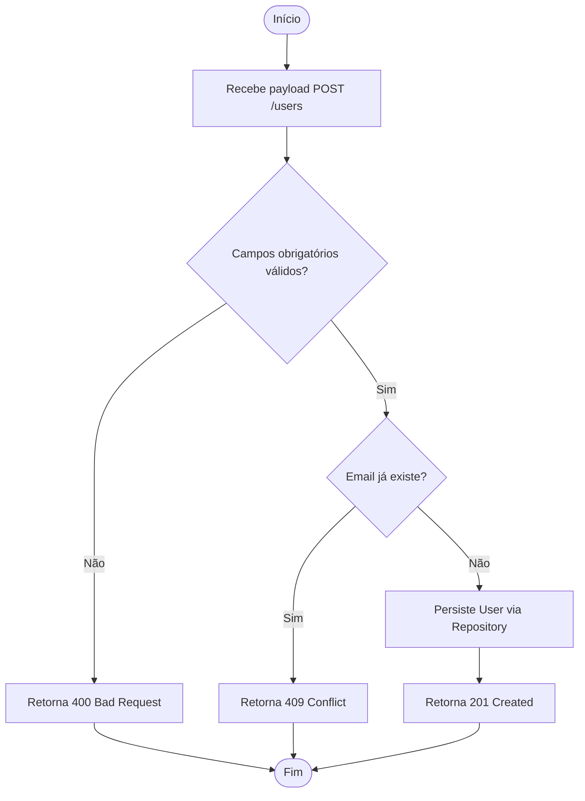

</details>

<details>
<summary><strong>🟢 5.6 Diagrama de Máquina de Estados — Ciclo de Vida do Usuário</strong></summary>

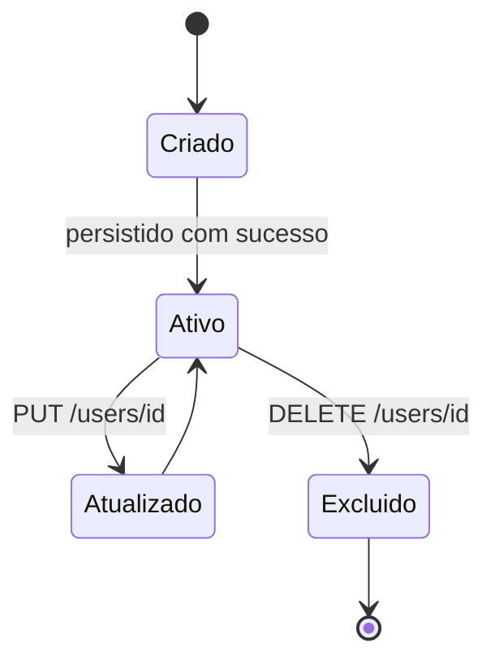

</details>

<details>
<summary><strong>📦 5.7 Diagrama de Componentes</strong></summary>

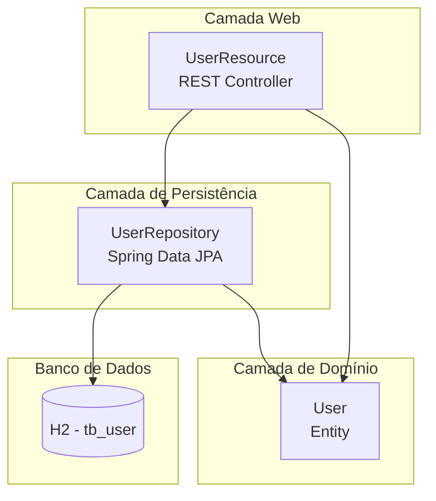

</details>

<details>
<summary><strong>🖥️ 5.8 Diagrama de Implantação (Deployment)</strong></summary>

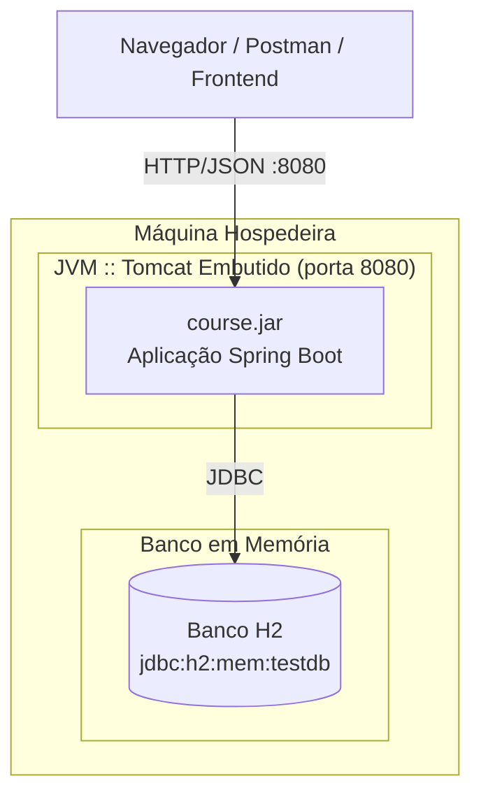

</details>

<details>
<summary><strong>📂 5.9 Diagrama de Pacotes</strong></summary>

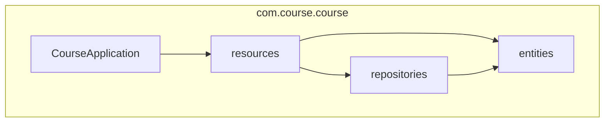

</details>

<details>
<summary><strong>🧬 5.10 Diagrama de Estrutura Composta — UserResource</strong></summary>

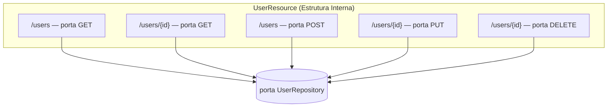

</details>

<details>
<summary><strong>🌀 5.11 Diagrama de Visão Geral de Interação</strong></summary>

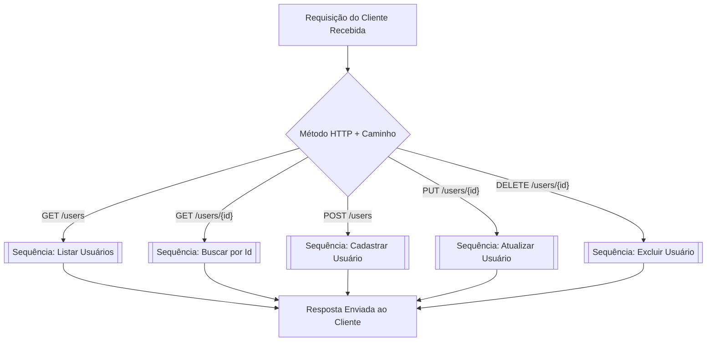

</details>

<details>
<summary><strong>⏱️ 5.12 Diagrama de Tempo (Timing) — Ciclo de Vida da Requisição</strong></summary>

| Tempo → | t0 | t1 | t2 | t3 | t4 |
|:-------|:--:|:--:|:--:|:--:|:--:|
| **Cliente** | `REQUISIÇÃO enviada` | ocioso | ocioso | ocioso | `RESPOSTA recebida` |
| **UserResource** | ocioso | `RECEBIDO` | `PROCESSANDO` | `RETORNANDO` | ocioso |
| **UserRepository** | ocioso | ocioso | `CONSULTA` | `RESULTADO` | ocioso |
| **Banco H2** | ocioso | ocioso | `EXECUTA SELECT` | ocioso | ocioso |

</details>

---

## 6. Modelo de Dados e Dicionário de Dados

<details>
<summary><strong>🗄️ 6.1 Diagrama Entidade-Relacionamento (DER)</strong></summary>

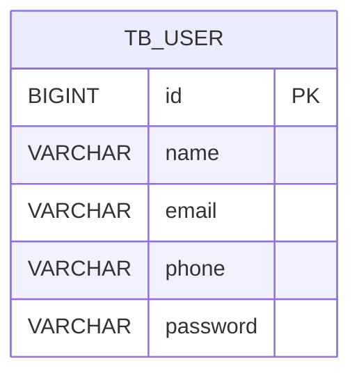

</details>

<details>
<summary><strong>🧠 6.2 Modelo Conceitual</strong></summary>

> No nível conceitual, o domínio gira em torno de uma única entidade, **User**, representando
> qualquer pessoa que interage com o sistema. Iterações futuras podem relacionar `User` com
> as entidades `Order` (Pedido) e `Role` (Perfil).

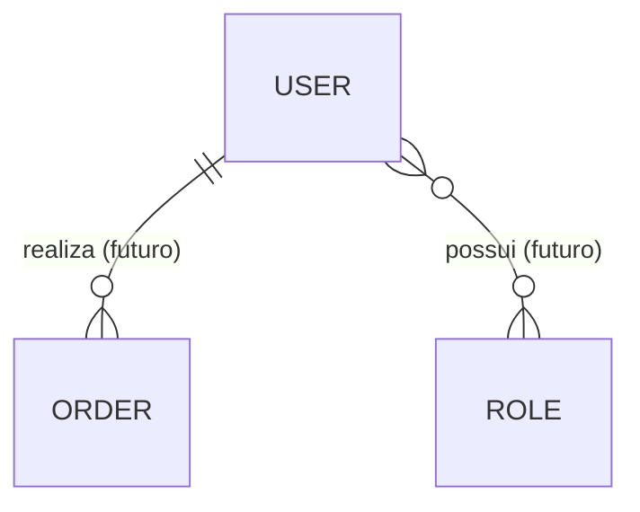

</details>

<details>
<summary><strong>🔎 6.3 Modelo Lógico</strong></summary>

| Entidade | Atributo | Tipo | Chave |
|:-------|:----------|:-----|:----|
| User | id | Inteiro | PK |
| User | name | Texto | — |
| User | email | Texto | Único |
| User | phone | Texto | — |
| User | password | Texto | — |

</details>

<details>
<summary><strong>⚙️ 6.4 Modelo Físico</strong></summary>

```sql
CREATE TABLE tb_user (
    id       BIGINT AUTO_INCREMENT PRIMARY KEY,
    name     VARCHAR(100) NOT NULL,
    email    VARCHAR(100) NOT NULL UNIQUE,
    phone    VARCHAR(20),
    password VARCHAR(100) NOT NULL
);
```

</details>

<details>
<summary><strong>📚 6.5 Dicionário de Dados</strong></summary>

| Tabela | Coluna | Tipo | Nulo? | Descrição |
|:------|:-------|:-----|:-----:|:------------|
| `tb_user` | `id` | `BIGINT` | Não | Chave primária substituta, auto-incremento |
| `tb_user` | `name` | `VARCHAR(100)` | Não | Nome completo do usuário |
| `tb_user` | `email` | `VARCHAR(100)` | Não | Endereço de e-mail único, candidato a login |
| `tb_user` | `phone` | `VARCHAR(20)` | Sim | Número de telefone de contato |
| `tb_user` | `password` | `VARCHAR(100)` | Não | Senha do usuário (texto puro hoje, hash no futuro) |

</details>

---

## 7. Diagrama de Fluxo de Dados (DFD)

<details>
<summary><strong>🔀 7.1 DFD Nível 0 (Contexto)</strong></summary>

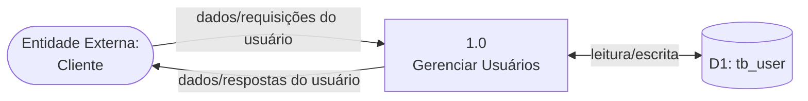

</details>

<details>
<summary><strong>🔀 7.2 DFD Nível 1 (Detalhado)</strong></summary>

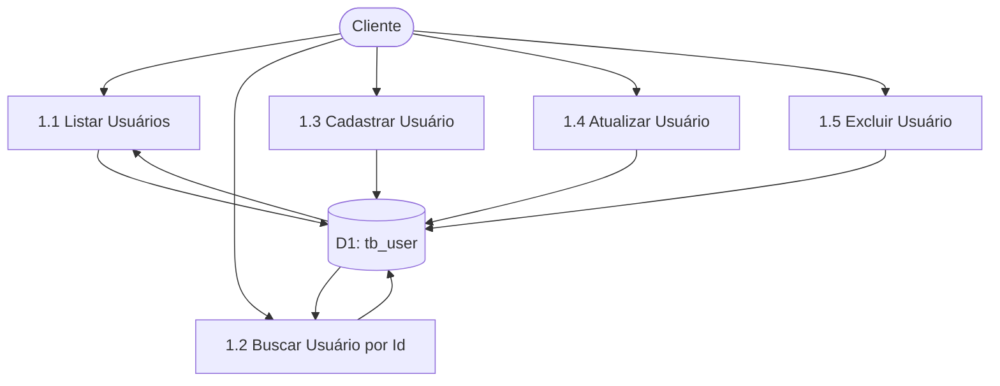

</details>

<details>
<summary><strong>🧵 7.3 Diagrama de Linhagem de Dados (Data Lineage)</strong></summary>

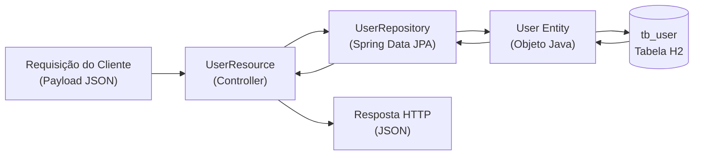

</details>

---

## 8. Diagrama de Arquitetura e Fluxograma

<details>
<summary><strong>🏗️ 8.1 Arquitetura em Camadas</strong></summary>

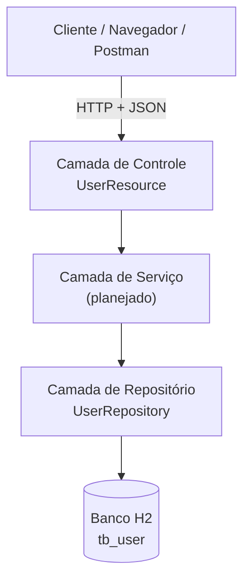

</details>

<details>
<summary><strong>🔁 8.2 Fluxograma da Aplicação — Tratamento de Requisições</strong></summary>

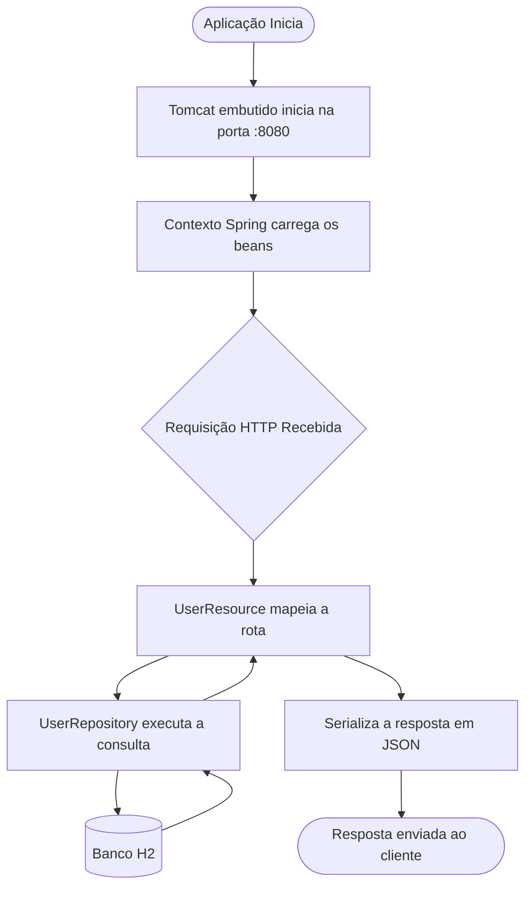

</details>

---

## 9. Persona e Mapa de Jornada do Usuário

<details>
<summary><strong>🧑‍💼 9.1 Persona</strong></summary>

| Atributo | Descrição |
|:----------|:-------------|
| **Nome** | Maria Brown |
| **Função** | Desenvolvedora Backend / Consumidora da API |
| **Idade** | 29 |
| **Objetivos** | Testar rapidamente as operações CRUD do módulo de Usuário via cliente REST. |
| **Frustrações** | Falta de documentação da API; mensagens de erro pouco claras. |
| **Proficiência Técnica** | Alta — confortável com Postman, JSON e códigos de status HTTP. |
| **Necessidades** | Endpoints previsíveis, estrutura JSON consistente, códigos de status claros. |

</details>

<details>
<summary><strong>🗺️ 9.2 Mapa de Jornada do Usuário</strong></summary>

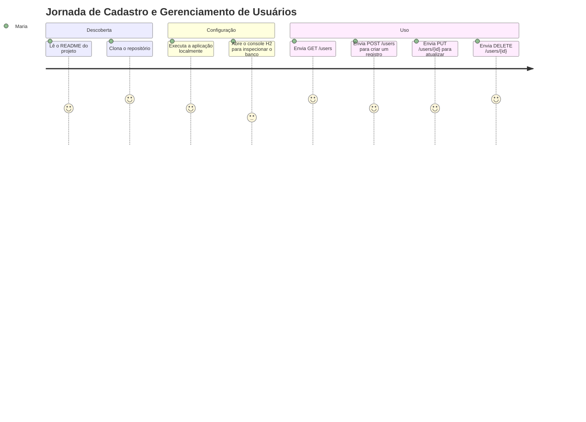

</details>

---

## 10. Wireframes e Mockups

<details>
<summary><strong>🎨 10.1 Tela de Listagem de Usuários (Wireframe)</strong></summary>

```
┌──────────────────────────────────────────────┐
│  Usuários                               [ + ] │
├──────────────────────────────────────────────┤
│  ID │ Nome          │ Email          │ Fone   │
├─────┼───────────────┼────────────────┼────────┤
│  1  │ Maria Brown   │ maria@mail.com │ 98888  │
│  2  │ Alex Green    │ alex@mail.com  │ 97777  │
├──────────────────────────────────────────────┤
│              [Editar]   [Excluir]             │
└──────────────────────────────────────────────┘
```

</details>

<details>
<summary><strong>📝 10.2 Formulário de Usuário (Criar / Editar) — Mockup</strong></summary>

```
┌──────────────────────────────────────────────┐
│  Novo Usuário                                 │
├──────────────────────────────────────────────┤
│  Nome     [____________________________]     │
│  Email    [____________________________]     │
│  Telefone [____________________________]     │
│  Senha    [____________________________]     │
│                                                │
│              [ Cancelar ]   [ Salvar ]        │
└──────────────────────────────────────────────┘
```

</details>

---

## 🚀 Instalação e Execução

### ✅ Pré-requisitos

| Requisito | Detalhe |
|:------------|:--------|
| **Java (JDK)** | Versão **17 ou superior** |
| **Ferramenta de Build** | Gradle Wrapper (`gradlew`) incluído — sem necessidade de instalação global |
| **IDE** | IntelliJ IDEA, Eclipse ou VS Code (recomendado) |

### 🔧 Passos

```bash
# 1. Clone o repositório
git clone https://github.com/VictorHJesusSantiago/workshop-springboot3-jpa.git
cd workshop-springboot3-jpa

# 2. Execute a aplicação
# Linux / macOS
./gradlew bootRun

# Windows
.\gradlew.bat bootRun
```

### 🛰️ Endpoints

| Serviço | URL |
|:--------|:----|
| 👤 API de Usuários | `http://localhost:8080/users` |
| 🖥️ Console H2 | `http://localhost:8080/h2-console` |

**Credenciais do Console H2:**

| Campo | Valor |
|:------|:------|
| JDBC URL | `jdbc:h2:mem:testdb` |
| Usuário | `sa` |
| Senha | *(deixe em branco)* |

---

## 👨‍💻 Autor

<div align="center">

**Victor Henrique de Jesus Santiago**
Full Stack Developer

[](mailto:victorhenriquedejesussantiago@gmail.com)
[](https://www.linkedin.com/in/victor-henrique-de-jesus-santiago/)
[](https://github.com/VictorHJesusSantiago)

</div>
